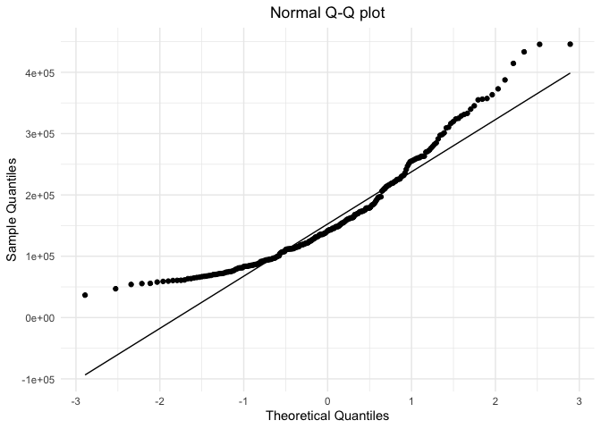
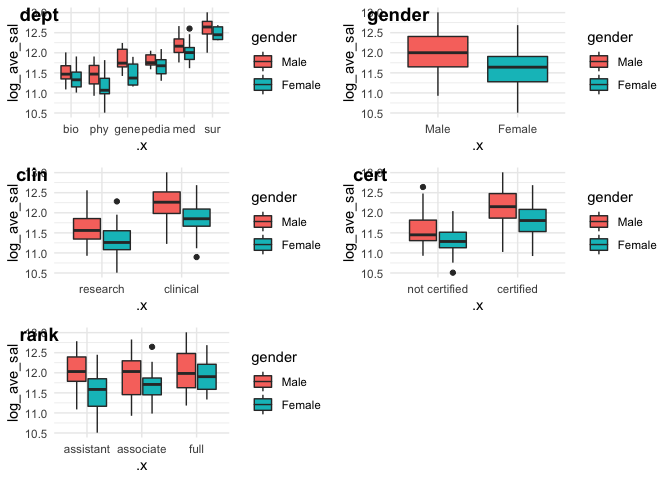

EDA
================
xj2249
2019/12/4

# clean data

``` r
law_df <- 
    read_csv("Lawsuit.csv") %>% 
    janitor::clean_names() %>% 
    select(-id) %>% 
    mutate(gender = factor(gender,labels = c("Female","Male")),
           gender = relevel(gender, ref = "Male"),
           dept = factor(dept, labels = c("bio","phy","gene","pedia","med","sur")),
           clin = factor(clin, labels = c("research","clinical")),
           cert = factor(cert, labels = c("not certified","certified")),
           rank = factor(rank,labels = c("assistant","associate","full")),
           )
```

    ## Parsed with column specification:
    ## cols(
    ##   ID = col_double(),
    ##   Dept = col_double(),
    ##   Gender = col_double(),
    ##   Clin = col_double(),
    ##   Cert = col_double(),
    ##   Prate = col_double(),
    ##   Exper = col_double(),
    ##   Rank = col_double(),
    ##   Sal94 = col_double(),
    ##   Sal95 = col_double()
    ## )

## consider transform response variable

``` r
law_df %>% 
    ggplot(aes(x = sal94)) +
    geom_histogram()
```

    ## `stat_bin()` using `bins = 30`. Pick better value with `binwidth`.

<!-- -->

``` r
law_df %>% 
    pull(sal94) %>%
    qqnorm()
```

<!-- -->

``` r
law_df <- 
    law_df %>% 
    mutate(sal94 = log(sal94),
           sal95 = log(sal94),
           percent = (sal95 - sal94)/sal94)
law_df %>% 
    pull(sal94) %>%
    qqnorm()
```

<!-- -->

# 1\. Confounders

## 1.1 table1(covariates and outcome by gender)

``` r
# descriptive statistics for variables of interest
control_table <- tableby.control(
        total = T,
        test = T,
        numeric.stats = c("meansd","medianq1q3","range"),
        stats.labels = list(meansd = "Mean (SD)",
                            medianq1q3 = "Median (Q1, Q3)",
                            range = "Min - Max"),
        digits = 2
        ) 
# cat.stats = "countrowpct" 

law_df %>% 
        tableby(gender ~ .,
                data = .,
                control = control_table) %>% 
        summary(text = TRUE) %>% 
        kableExtra::kable(caption = "Characcteristics of college faculty") 
```

<table>

<caption>

Characcteristics of college faculty

</caption>

<thead>

<tr>

<th style="text-align:left;">

</th>

<th style="text-align:left;">

Male (N=155)

</th>

<th style="text-align:left;">

Female (N=106)

</th>

<th style="text-align:left;">

Total (N=261)

</th>

<th style="text-align:left;">

p value

</th>

</tr>

</thead>

<tbody>

<tr>

<td style="text-align:left;">

dept

</td>

<td style="text-align:left;">

</td>

<td style="text-align:left;">

</td>

<td style="text-align:left;">

</td>

<td style="text-align:left;">

\< 0.001

</td>

</tr>

<tr>

<td style="text-align:left;">

  - bio
    </td>
    <td style="text-align:left;">
    30 (19.4%)
    </td>
    <td style="text-align:left;">
    20 (18.9%)
    </td>
    <td style="text-align:left;">
    50 (19.2%)
    </td>
    <td style="text-align:left;">
    </td>
    </tr>
    <tr>
    <td style="text-align:left;">
      - phy
        </td>
        <td style="text-align:left;">
        20 (12.9%)
        </td>
        <td style="text-align:left;">
        20 (18.9%)
        </td>
        <td style="text-align:left;">
        40 (15.3%)
        </td>
        <td style="text-align:left;">
        </td>
        </tr>
        <tr>
        <td style="text-align:left;">
          - gene
            </td>
            <td style="text-align:left;">
            10 (6.5%)
            </td>
            <td style="text-align:left;">
            11 (10.4%)
            </td>
            <td style="text-align:left;">
            21 (8.0%)
            </td>
            <td style="text-align:left;">
            </td>
            </tr>
            <tr>
            <td style="text-align:left;">
              - pedia
                </td>
                <td style="text-align:left;">
                10 (6.5%)
                </td>
                <td style="text-align:left;">
                20 (18.9%)
                </td>
                <td style="text-align:left;">
                30 (11.5%)
                </td>
                <td style="text-align:left;">
                </td>
                </tr>
                <tr>
                <td style="text-align:left;">
                  - med
                    </td>
                    <td style="text-align:left;">
                    50 (32.3%)
                    </td>
                    <td style="text-align:left;">
                    30 (28.3%)
                    </td>
                    <td style="text-align:left;">
                    80 (30.7%)
                    </td>
                    <td style="text-align:left;">
                    </td>
                    </tr>
                    <tr>
                    <td style="text-align:left;">
                      - sur
                        </td>
                        <td style="text-align:left;">
                        35 (22.6%)
                        </td>
                        <td style="text-align:left;">
                        5 (4.7%)
                        </td>
                        <td style="text-align:left;">
                        40 (15.3%)
                        </td>
                        <td style="text-align:left;">
                        </td>
                        </tr>
                        <tr>
                        <td style="text-align:left;">
                        clin
                        </td>
                        <td style="text-align:left;">
                        </td>
                        <td style="text-align:left;">
                        </td>
                        <td style="text-align:left;">
                        </td>
                        <td style="text-align:left;">
                        0.197
                        </td>
                        </tr>
                        <tr>
                        <td style="text-align:left;">
                          - research
                            </td>
                            <td style="text-align:left;">
                            55 (35.5%)
                            </td>
                            <td style="text-align:left;">
                            46 (43.4%)
                            </td>
                            <td style="text-align:left;">
                            101 (38.7%)
                            </td>
                            <td style="text-align:left;">
                            </td>
                            </tr>
                            <tr>
                            <td style="text-align:left;">
                              - clinical
                                </td>
                                <td style="text-align:left;">
                                100 (64.5%)
                                </td>
                                <td style="text-align:left;">
                                60 (56.6%)
                                </td>
                                <td style="text-align:left;">
                                160 (61.3%)
                                </td>
                                <td style="text-align:left;">
                                </td>
                                </tr>
                                <tr>
                                <td style="text-align:left;">
                                cert
                                </td>
                                <td style="text-align:left;">
                                </td>
                                <td style="text-align:left;">
                                </td>
                                <td style="text-align:left;">
                                </td>
                                <td style="text-align:left;">
                                0.074
                                </td>
                                </tr>
                                <tr>
                                <td style="text-align:left;">
                                  - not certified
                                    </td>
                                    <td style="text-align:left;">
                                    37 (23.9%)
                                    </td>
                                    <td style="text-align:left;">
                                    36 (34.0%)
                                    </td>
                                    <td style="text-align:left;">
                                    73 (28.0%)
                                    </td>
                                    <td style="text-align:left;">
                                    </td>
                                    </tr>
                                    <tr>
                                    <td style="text-align:left;">
                                      - certified
                                        </td>
                                        <td style="text-align:left;">
                                        118 (76.1%)
                                        </td>
                                        <td style="text-align:left;">
                                        70 (66.0%)
                                        </td>
                                        <td style="text-align:left;">
                                        188 (72.0%)
                                        </td>
                                        <td style="text-align:left;">
                                        </td>
                                        </tr>
                                        <tr>
                                        <td style="text-align:left;">
                                        prate
                                        </td>
                                        <td style="text-align:left;">
                                        </td>
                                        <td style="text-align:left;">
                                        </td>
                                        <td style="text-align:left;">
                                        </td>
                                        <td style="text-align:left;">
                                        0.004
                                        </td>
                                        </tr>
                                        <tr>
                                        <td style="text-align:left;">
                                          - Mean
                                            (SD)
                                            </td>
                                            <td style="text-align:left;">
                                            4.65
                                            (1.94)
                                            </td>
                                            <td style="text-align:left;">
                                            5.35
                                            (1.89)
                                            </td>
                                            <td style="text-align:left;">
                                            4.93
                                            (1.94)
                                            </td>
                                            <td style="text-align:left;">
                                            </td>
                                            </tr>
                                            <tr>
                                            <td style="text-align:left;">
                                              - Median (Q1,
                                                Q3)
                                                </td>
                                                <td style="text-align:left;">
                                                4.00 (3.10,
                                                6.70)
                                                </td>
                                                <td style="text-align:left;">
                                                5.25 (3.73,
                                                7.27)
                                                </td>
                                                <td style="text-align:left;">
                                                4.40 (3.20,
                                                6.90)
                                                </td>
                                                <td style="text-align:left;">
                                                </td>
                                                </tr>
                                                <tr>
                                                <td style="text-align:left;">
                                                  - Min -
                                                    Max
                                                    </td>
                                                    <td style="text-align:left;">
                                                    1.30 -
                                                    8.60
                                                    </td>
                                                    <td style="text-align:left;">
                                                    2.40 -
                                                    8.70
                                                    </td>
                                                    <td style="text-align:left;">
                                                    1.30 -
                                                    8.70
                                                    </td>
                                                    <td style="text-align:left;">
                                                    </td>
                                                    </tr>
                                                    <tr>
                                                    <td style="text-align:left;">
                                                    exper
                                                    </td>
                                                    <td style="text-align:left;">
                                                    </td>
                                                    <td style="text-align:left;">
                                                    </td>
                                                    <td style="text-align:left;">
                                                    </td>
                                                    <td style="text-align:left;">
                                                    \<
                                                    0.001
                                                    </td>
                                                    </tr>
                                                    <tr>
                                                    <td style="text-align:left;">
                                                      - Mean
                                                        (SD)
                                                        </td>
                                                        <td style="text-align:left;">
                                                        12.10
                                                        (6.70)
                                                        </td>
                                                        <td style="text-align:left;">
                                                        7.49
                                                        (4.17)
                                                        </td>
                                                        <td style="text-align:left;">
                                                        10.23
                                                        (6.23)
                                                        </td>
                                                        <td style="text-align:left;">
                                                        </td>
                                                        </tr>
                                                        <tr>
                                                        <td style="text-align:left;">
                                                          - Median (Q1,
                                                            Q3)
                                                            </td>
                                                            <td style="text-align:left;">
                                                            10.00 (7.00,
                                                            15.00)
                                                            </td>
                                                            <td style="text-align:left;">
                                                            7.00 (5.00,
                                                            10.00)
                                                            </td>
                                                            <td style="text-align:left;">
                                                            9.00 (6.00,
                                                            14.00)
                                                            </td>
                                                            <td style="text-align:left;">
                                                            </td>
                                                            </tr>
                                                            <tr>
                                                            <td style="text-align:left;">
                                                              - Min -
                                                                Max
                                                                </td>
                                                                <td style="text-align:left;">
                                                                2.00 -
                                                                37.00
                                                                </td>
                                                                <td style="text-align:left;">
                                                                1.00 -
                                                                23.00
                                                                </td>
                                                                <td style="text-align:left;">
                                                                1.00 -
                                                                37.00
                                                                </td>
                                                                <td style="text-align:left;">
                                                                </td>
                                                                </tr>
                                                                <tr>
                                                                <td style="text-align:left;">
                                                                rank
                                                                </td>
                                                                <td style="text-align:left;">
                                                                </td>
                                                                <td style="text-align:left;">
                                                                </td>
                                                                <td style="text-align:left;">
                                                                </td>
                                                                <td style="text-align:left;">
                                                                \<
                                                                0.001
                                                                </td>
                                                                </tr>
                                                                <tr>
                                                                <td style="text-align:left;">
                                                                  - assistant
                                                                    </td>
                                                                    <td style="text-align:left;">
                                                                    43
                                                                    (27.7%)
                                                                    </td>
                                                                    <td style="text-align:left;">
                                                                    69
                                                                    (65.1%)
                                                                    </td>
                                                                    <td style="text-align:left;">
                                                                    112
                                                                    (42.9%)
                                                                    </td>
                                                                    <td style="text-align:left;">
                                                                    </td>
                                                                    </tr>
                                                                    <tr>
                                                                    <td style="text-align:left;">
                                                                      - associate
                                                                        </td>
                                                                        <td style="text-align:left;">
                                                                        43
                                                                        (27.7%)
                                                                        </td>
                                                                        <td style="text-align:left;">
                                                                        21
                                                                        (19.8%)
                                                                        </td>
                                                                        <td style="text-align:left;">
                                                                        64
                                                                        (24.5%)
                                                                        </td>
                                                                        <td style="text-align:left;">
                                                                        </td>
                                                                        </tr>
                                                                        <tr>
                                                                        <td style="text-align:left;">
                                                                          - full
                                                                            </td>
                                                                            <td style="text-align:left;">
                                                                            69
                                                                            (44.5%)
                                                                            </td>
                                                                            <td style="text-align:left;">
                                                                            16
                                                                            (15.1%)
                                                                            </td>
                                                                            <td style="text-align:left;">
                                                                            85
                                                                            (32.6%)
                                                                            </td>
                                                                            <td style="text-align:left;">
                                                                            </td>
                                                                            </tr>
                                                                            <tr>
                                                                            <td style="text-align:left;">
                                                                            sal94
                                                                            </td>
                                                                            <td style="text-align:left;">
                                                                            </td>
                                                                            <td style="text-align:left;">
                                                                            </td>
                                                                            <td style="text-align:left;">
                                                                            </td>
                                                                            <td style="text-align:left;">
                                                                            \<
                                                                            0.001
                                                                            </td>
                                                                            </tr>
                                                                            <tr>
                                                                            <td style="text-align:left;">
                                                                              - Mean
                                                                                (SD)
                                                                                </td>
                                                                                <td style="text-align:left;">
                                                                                11.97
                                                                                (0.49)
                                                                                </td>
                                                                                <td style="text-align:left;">
                                                                                11.58
                                                                                (0.45)
                                                                                </td>
                                                                                <td style="text-align:left;">
                                                                                11.81
                                                                                (0.51)
                                                                                </td>
                                                                                <td style="text-align:left;">
                                                                                </td>
                                                                                </tr>
                                                                                <tr>
                                                                                <td style="text-align:left;">
                                                                                  - Median
                                                                                    (Q1,
                                                                                    Q3)
                                                                                    </td>
                                                                                    <td style="text-align:left;">
                                                                                    11.95
                                                                                    (11.61,
                                                                                    12.35)
                                                                                    </td>
                                                                                    <td style="text-align:left;">
                                                                                    11.59
                                                                                    (11.24,
                                                                                    11.87)
                                                                                    </td>
                                                                                    <td style="text-align:left;">
                                                                                    11.80
                                                                                    (11.42,
                                                                                    12.21)
                                                                                    </td>
                                                                                    <td style="text-align:left;">
                                                                                    </td>
                                                                                    </tr>
                                                                                    <tr>
                                                                                    <td style="text-align:left;">
                                                                                      - Min
                                                                                        -
                                                                                        Max
                                                                                        </td>
                                                                                        <td style="text-align:left;">
                                                                                        10.87
                                                                                        -
                                                                                        12.97
                                                                                        </td>
                                                                                        <td style="text-align:left;">
                                                                                        10.45
                                                                                        -
                                                                                        12.64
                                                                                        </td>
                                                                                        <td style="text-align:left;">
                                                                                        10.45
                                                                                        -
                                                                                        12.97
                                                                                        </td>
                                                                                        <td style="text-align:left;">
                                                                                        </td>
                                                                                        </tr>
                                                                                        <tr>
                                                                                        <td style="text-align:left;">
                                                                                        sal95
                                                                                        </td>
                                                                                        <td style="text-align:left;">
                                                                                        </td>
                                                                                        <td style="text-align:left;">
                                                                                        </td>
                                                                                        <td style="text-align:left;">
                                                                                        </td>
                                                                                        <td style="text-align:left;">
                                                                                        \<
                                                                                        0.001
                                                                                        </td>
                                                                                        </tr>
                                                                                        <tr>
                                                                                        <td style="text-align:left;">
                                                                                          - Mean
                                                                                            (SD)
                                                                                            </td>
                                                                                            <td style="text-align:left;">
                                                                                            2.48
                                                                                            (0.04)
                                                                                            </td>
                                                                                            <td style="text-align:left;">
                                                                                            2.45
                                                                                            (0.04)
                                                                                            </td>
                                                                                            <td style="text-align:left;">
                                                                                            2.47
                                                                                            (0.04)
                                                                                            </td>
                                                                                            <td style="text-align:left;">
                                                                                            </td>
                                                                                            </tr>
                                                                                            <tr>
                                                                                            <td style="text-align:left;">
                                                                                              - Median
                                                                                                (Q1,
                                                                                                Q3)
                                                                                                </td>
                                                                                                <td style="text-align:left;">
                                                                                                2.48
                                                                                                (2.45,
                                                                                                2.51)
                                                                                                </td>
                                                                                                <td style="text-align:left;">
                                                                                                2.45
                                                                                                (2.42,
                                                                                                2.47)
                                                                                                </td>
                                                                                                <td style="text-align:left;">
                                                                                                2.47
                                                                                                (2.44,
                                                                                                2.50)
                                                                                                </td>
                                                                                                <td style="text-align:left;">
                                                                                                </td>
                                                                                                </tr>
                                                                                                <tr>
                                                                                                <td style="text-align:left;">
                                                                                                  - Min
                                                                                                    -
                                                                                                    Max
                                                                                                    </td>
                                                                                                    <td style="text-align:left;">
                                                                                                    2.39
                                                                                                    -
                                                                                                    2.56
                                                                                                    </td>
                                                                                                    <td style="text-align:left;">
                                                                                                    2.35
                                                                                                    -
                                                                                                    2.54
                                                                                                    </td>
                                                                                                    <td style="text-align:left;">
                                                                                                    2.35
                                                                                                    -
                                                                                                    2.56
                                                                                                    </td>
                                                                                                    <td style="text-align:left;">
                                                                                                    </td>
                                                                                                    </tr>
                                                                                                    <tr>
                                                                                                    <td style="text-align:left;">
                                                                                                    percent
                                                                                                    </td>
                                                                                                    <td style="text-align:left;">
                                                                                                    </td>
                                                                                                    <td style="text-align:left;">
                                                                                                    </td>
                                                                                                    <td style="text-align:left;">
                                                                                                    </td>
                                                                                                    <td style="text-align:left;">
                                                                                                    \<
                                                                                                    0.001
                                                                                                    </td>
                                                                                                    </tr>
                                                                                                    <tr>
                                                                                                    <td style="text-align:left;">
                                                                                                      - Mean
                                                                                                        (SD)
                                                                                                        </td>
                                                                                                        <td style="text-align:left;">
                                                                                                        \-0.79
                                                                                                        (0.01)
                                                                                                        </td>
                                                                                                        <td style="text-align:left;">
                                                                                                        \-0.79
                                                                                                        (0.00)
                                                                                                        </td>
                                                                                                        <td style="text-align:left;">
                                                                                                        \-0.79
                                                                                                        (0.01)
                                                                                                        </td>
                                                                                                        <td style="text-align:left;">
                                                                                                        </td>
                                                                                                        </tr>
                                                                                                        <tr>
                                                                                                        <td style="text-align:left;">
                                                                                                          - Median
                                                                                                            (Q1,
                                                                                                            Q3)
                                                                                                            </td>
                                                                                                            <td style="text-align:left;">
                                                                                                            \-0.79
                                                                                                            (-0.80,
                                                                                                            -0.79)
                                                                                                            </td>
                                                                                                            <td style="text-align:left;">
                                                                                                            \-0.79
                                                                                                            (-0.79,
                                                                                                            -0.78)
                                                                                                            </td>
                                                                                                            <td style="text-align:left;">
                                                                                                            \-0.79
                                                                                                            (-0.80,
                                                                                                            -0.79)
                                                                                                            </td>
                                                                                                            <td style="text-align:left;">
                                                                                                            </td>
                                                                                                            </tr>
                                                                                                            <tr>
                                                                                                            <td style="text-align:left;">
                                                                                                              - Min
                                                                                                                -
                                                                                                                Max
                                                                                                                </td>
                                                                                                                <td style="text-align:left;">
                                                                                                                \-0.80
                                                                                                                -
                                                                                                                -0.78
                                                                                                                </td>
                                                                                                                <td style="text-align:left;">
                                                                                                                \-0.80
                                                                                                                -
                                                                                                                -0.78
                                                                                                                </td>
                                                                                                                <td style="text-align:left;">
                                                                                                                \-0.80
                                                                                                                -
                                                                                                                -0.78
                                                                                                                </td>
                                                                                                                <td style="text-align:left;">
                                                                                                                </td>
                                                                                                                </tr>
                                                                                                                </tbody>
                                                                                                                </table>

The `clin` and `cert` has a p-value \>0.05 (but \< 0.20), suggesting
that the composition of `clin` and `cert` are not very different in
female and male. But still, we will check their impact on coefficient of
female
later.

# 1.2 exploratory visualization (relationship between salary and exposure/covariate)

## 1.2.1 categorical

``` r
map(law_df[,c(1:4,7)], 
    ~ggplot(aes(y = sal94,x = .x, fill = gender),data = law_df) + geom_boxplot()) %>% 
    cowplot::plot_grid(plotlist = .,ncol = 2,labels = colnames(law_df[,c(1:4,7)]))
```

<!-- -->

I want yo draw your attention to the `rank` plot. Seems that for male,
salary doesnt change that much from assistant to full professor. But
for female, it changes a lot.

## 1.2.2 continuous

``` r
map(law_df[,5:6], 
    ~ggplot(aes(y = sal94,x = .x, color = gender),data = law_df) + 
            geom_point() + 
            geom_smooth(method = "lm",se = F)) %>%
    cowplot::plot_grid(plotlist = .,ncol = 1,labels = colnames(law_df[,5:6]))
```

<!-- -->

We see a non-parallel(slightly) slope of `exper`, so we may consider
interaction term in our model.

## 1.3 Adjusted vs crude coefficients of female.

``` r
crude <- 
    lm(sal94 ~ gender, data = law_df) %>% 
    broom::tidy() %>% 
    filter(term == "genderFemale") %>% 
    pull(estimate)

adj <-
    law_df %>% 
    select(dept,clin,cert,prate,exper,rank) %>% 
    map(~lm(sal94 ~ gender + .x, data = law_df) %>% broom::tidy()) %>% 
    map_dbl(~filter(.x,term == "genderFemale") %>% pull(estimate)) 

change <- round(100*(crude - adj)/crude,digits = 2)
change
```

    ##  dept  clin  cert prate exper  rank 
    ## 46.62 12.40 13.59 34.43 20.11  9.22

Rule of thumb, these covariate can all be confounders.

# 2\. Interaction:only consider two-way for now

First, I think its ok(or not wrong) not to include interaction in our
model. Buts its interesting to explore the interaction

## 2.1 continuous-exper

``` r
lm(sal94 ~ gender*exper, data = law_df) %>% summary()
```

    ## 
    ## Call:
    ## lm(formula = sal94 ~ gender * exper, data = law_df)
    ## 
    ## Residuals:
    ##      Min       1Q   Median       3Q      Max 
    ## -1.00503 -0.36180  0.02023  0.34885  1.00884 
    ## 
    ## Coefficients:
    ##                     Estimate Std. Error t value Pr(>|t|)    
    ## (Intercept)        11.808010   0.076815 153.720  < 2e-16 ***
    ## genderFemale       -0.446824   0.120388  -3.712 0.000253 ***
    ## exper               0.013429   0.005556   2.417 0.016344 *  
    ## genderFemale:exper  0.016358   0.012169   1.344 0.180065    
    ## ---
    ## Signif. codes:  0 '***' 0.001 '**' 0.01 '*' 0.05 '.' 0.1 ' ' 1
    ## 
    ## Residual standard error: 0.4622 on 257 degrees of freedom
    ## Multiple R-squared:  0.1825, Adjusted R-squared:  0.1729 
    ## F-statistic: 19.12 on 3 and 257 DF,  p-value: 3.174e-11

The interaction term is not sig.

## 2.2 categorical

``` r
lm(sal94 ~ gender*dept, data = law_df) %>% summary()
```

    ## 
    ## Call:
    ## lm(formula = sal94 ~ gender * dept, data = law_df)
    ## 
    ## Residuals:
    ##     Min      1Q  Median      3Q     Max 
    ## -0.6593 -0.1864 -0.0359  0.1673  0.6492 
    ## 
    ## Coefficients:
    ##                          Estimate Std. Error t value Pr(>|t|)    
    ## (Intercept)            11.4885070  0.0461070 249.171  < 2e-16 ***
    ## genderFemale           -0.1674974  0.0729016  -2.298  0.02242 *  
    ## deptphy                -0.0616152  0.0729016  -0.845  0.39882    
    ## deptgene                0.3051883  0.0922140   3.310  0.00107 ** 
    ## deptpedia               0.2659146  0.0922140   2.884  0.00427 ** 
    ## deptmed                 0.6491313  0.0583212  11.130  < 2e-16 ***
    ## deptsur                 1.0794653  0.0628332  17.180  < 2e-16 ***
    ## genderFemale:deptphy   -0.1509514  0.1081305  -1.396  0.16395    
    ## genderFemale:deptgene  -0.2091415  0.1322497  -1.581  0.11505    
    ## genderFemale:deptpedia  0.0365429  0.1219876   0.300  0.76476    
    ## genderFemale:deptmed    0.0006635  0.0933595   0.007  0.99433    
    ## genderFemale:deptsur    0.0329106  0.1410387   0.233  0.81569    
    ## ---
    ## Signif. codes:  0 '***' 0.001 '**' 0.01 '*' 0.05 '.' 0.1 ' ' 1
    ## 
    ## Residual standard error: 0.2525 on 249 degrees of freedom
    ## Multiple R-squared:  0.7636, Adjusted R-squared:  0.7531 
    ## F-statistic:  73.1 on 11 and 249 DF,  p-value: < 2.2e-16

``` r
lm(sal94 ~ gender*clin, data = law_df) %>% summary()
```

    ## 
    ## Call:
    ## lm(formula = sal94 ~ gender * clin, data = law_df)
    ## 
    ## Residuals:
    ##     Min      1Q  Median      3Q     Max 
    ## -1.0250 -0.2522 -0.0198  0.2552  0.9745 
    ## 
    ## Coefficients:
    ##                           Estimate Std. Error t value Pr(>|t|)    
    ## (Intercept)               11.55144    0.04982 231.877  < 2e-16 ***
    ## genderFemale              -0.27528    0.07382  -3.729 0.000236 ***
    ## clinclinical               0.64961    0.06202  10.474  < 2e-16 ***
    ## genderFemale:clinclinical -0.10522    0.09534  -1.104 0.270763    
    ## ---
    ## Signif. codes:  0 '***' 0.001 '**' 0.01 '*' 0.05 '.' 0.1 ' ' 1
    ## 
    ## Residual standard error: 0.3695 on 257 degrees of freedom
    ## Multiple R-squared:  0.4777, Adjusted R-squared:  0.4716 
    ## F-statistic: 78.35 on 3 and 257 DF,  p-value: < 2.2e-16

``` r
lm(sal94 ~ gender*cert, data = law_df) %>% summary()
```

    ## 
    ## Call:
    ## lm(formula = sal94 ~ gender * cert, data = law_df)
    ## 
    ## Residuals:
    ##      Min       1Q   Median       3Q      Max 
    ## -1.13417 -0.28087 -0.00954  0.30299  1.06282 
    ## 
    ## Coefficients:
    ##                            Estimate Std. Error t value Pr(>|t|)    
    ## (Intercept)                11.54323    0.06773 170.432  < 2e-16 ***
    ## genderFemale               -0.27000    0.09645  -2.799  0.00551 ** 
    ## certcertified               0.56131    0.07762   7.231 5.49e-12 ***
    ## genderFemale:certcertified -0.09025    0.11474  -0.787  0.43227    
    ## ---
    ## Signif. codes:  0 '***' 0.001 '**' 0.01 '*' 0.05 '.' 0.1 ' ' 1
    ## 
    ## Residual standard error: 0.412 on 257 degrees of freedom
    ## Multiple R-squared:  0.3505, Adjusted R-squared:  0.3429 
    ## F-statistic: 46.23 on 3 and 257 DF,  p-value: < 2.2e-16

``` r
lm(sal94 ~ gender*rank, data = law_df) %>% summary()
```

    ## 
    ## Call:
    ## lm(formula = sal94 ~ gender * rank, data = law_df)
    ## 
    ## Residuals:
    ##      Min       1Q   Median       3Q      Max 
    ## -1.05271 -0.37554  0.01028  0.34601  0.97298 
    ## 
    ## Coefficients:
    ##                            Estimate Std. Error t value Pr(>|t|)    
    ## (Intercept)                12.02235    0.07103 169.265  < 2e-16 ***
    ## genderFemale               -0.52052    0.09049  -5.752 2.52e-08 ***
    ## rankassociate              -0.14468    0.10045  -1.440   0.1510    
    ## rankfull                   -0.02620    0.09049  -0.290   0.7724    
    ## genderFemale:rankassociate  0.27194    0.15350   1.772   0.0777 .  
    ## genderFemale:rankfull       0.40560    0.15777   2.571   0.0107 *  
    ## ---
    ## Signif. codes:  0 '***' 0.001 '**' 0.01 '*' 0.05 '.' 0.1 ' ' 1
    ## 
    ## Residual standard error: 0.4658 on 255 degrees of freedom
    ## Multiple R-squared:  0.1764, Adjusted R-squared:  0.1602 
    ## F-statistic: 10.92 on 5 and 255 DF,  p-value: 1.551e-09

# 3.Multiple linear regression model

## 3.1 without any interaction

``` r
full <- lm(sal94 ~ gender + dept + clin + cert + prate + exper + rank, data = law_df) 
summary(full)
```

    ## 
    ## Call:
    ## lm(formula = sal94 ~ gender + dept + clin + cert + prate + exper + 
    ##     rank, data = law_df)
    ## 
    ## Residuals:
    ##      Min       1Q   Median       3Q      Max 
    ## -0.34833 -0.07668 -0.01446  0.08196  0.89241 
    ## 
    ## Coefficients:
    ##               Estimate Std. Error t value Pr(>|t|)    
    ## (Intercept)   11.11749    0.13102  84.850  < 2e-16 ***
    ## genderFemale  -0.02089    0.02027  -1.030 0.303817    
    ## deptphy       -0.17620    0.02916  -6.043 5.50e-09 ***
    ## deptgene       0.17021    0.03888   4.378 1.77e-05 ***
    ## deptpedia      0.14848    0.05375   2.762 0.006169 ** 
    ## deptmed        0.49591    0.04539  10.927  < 2e-16 ***
    ## deptsur        0.86754    0.06177  14.043  < 2e-16 ***
    ## clinclinical   0.16065    0.04124   3.896 0.000126 ***
    ## certcertified  0.19306    0.02129   9.070  < 2e-16 ***
    ## prate         -0.02207    0.01741  -1.268 0.205970    
    ## exper          0.01798    0.00183   9.828  < 2e-16 ***
    ## rankassociate  0.13105    0.02365   5.542 7.63e-08 ***
    ## rankfull       0.21854    0.02637   8.286 7.39e-15 ***
    ## ---
    ## Signif. codes:  0 '***' 0.001 '**' 0.01 '*' 0.05 '.' 0.1 ' ' 1
    ## 
    ## Residual standard error: 0.1338 on 248 degrees of freedom
    ## Multiple R-squared:  0.9339, Adjusted R-squared:  0.9307 
    ## F-statistic: 291.8 on 12 and 248 DF,  p-value: < 2.2e-16

``` r
par(mfrow = c(2,2))
plot(full)
```

<!-- -->

``` r
HH::vif(full)
```

    ##  genderFemale       deptphy      deptgene     deptpedia       deptmed 
    ##      1.443762      1.607184      1.629419      4.282664      6.379551 
    ##       deptsur  clinclinical certcertified         prate         exper 
    ##      7.215586      5.877635      1.329952     16.626048      1.884661 
    ## rankassociate      rankfull 
    ##      1.508016      2.225837

Ah. May be there is no obvious discrimination. (coz these confouders
maybe actually mediators.)

## stepwise(not sure if necessary)

``` r
lower_gender <- lm(sal94 ~ gender, data = law_df) 
step(full,scope = list(lower = lower_gender))
```

    ## Start:  AIC=-1037.13
    ## sal94 ~ gender + dept + clin + cert + prate + exper + rank
    ## 
    ##         Df Sum of Sq     RSS      AIC
    ## - prate  1    0.0288  4.4713 -1037.45
    ## <none>                4.4425 -1037.13
    ## - clin   1    0.2719  4.7143 -1023.63
    ## - rank   2    1.2528  5.6952  -976.30
    ## - cert   1    1.4736  5.9161  -964.37
    ## - exper  1    1.7301  6.1726  -953.29
    ## - dept   5    9.2120 13.6544  -754.07
    ## 
    ## Step:  AIC=-1037.45
    ## sal94 ~ gender + dept + clin + cert + exper + rank
    ## 
    ##         Df Sum of Sq     RSS      AIC
    ## <none>                4.4713 -1037.45
    ## - rank   2    1.2971  5.7683  -974.97
    ## - cert   1    1.4591  5.9303  -965.74
    ## - clin   1    1.5676  6.0389  -961.01
    ## - exper  1    1.7013  6.1726  -955.29
    ## - dept   5   21.7617 26.2329  -585.65

    ## 
    ## Call:
    ## lm(formula = sal94 ~ gender + dept + clin + cert + exper + rank, 
    ##     data = law_df)
    ## 
    ## Coefficients:
    ##   (Intercept)   genderFemale        deptphy       deptgene      deptpedia  
    ##      10.95612       -0.02721       -0.17643        0.18704        0.19938  
    ##       deptmed        deptsur   clinclinical  certcertified          exper  
    ##       0.53960        0.93158        0.20495        0.19194        0.01768  
    ## rankassociate       rankfull  
    ##       0.13326        0.22140

``` r
model_stepwise <- lm(formula = sal94 ~ gender + dept + clin + cert + exper + rank, data = law_df) %>% summary()
```

## 3.2 with some interaction

``` r
lm(sal94 ~ dept + clin + cert  +  exper + gender*rank, data = law_df) %>% summary()
```

    ## 
    ## Call:
    ## lm(formula = sal94 ~ dept + clin + cert + exper + gender * rank, 
    ##     data = law_df)
    ## 
    ## Residuals:
    ##      Min       1Q   Median       3Q      Max 
    ## -0.32349 -0.08234 -0.01600  0.07937  0.86050 
    ## 
    ## Coefficients:
    ##                             Estimate Std. Error t value Pr(>|t|)    
    ## (Intercept)                10.988933   0.033579 327.255  < 2e-16 ***
    ## deptphy                    -0.176223   0.028926  -6.092 4.25e-09 ***
    ## deptgene                    0.185648   0.036275   5.118 6.21e-07 ***
    ## deptpedia                   0.204541   0.035596   5.746 2.68e-08 ***
    ## deptmed                     0.543522   0.029420  18.475  < 2e-16 ***
    ## deptsur                     0.929067   0.035334  26.294  < 2e-16 ***
    ## clinclinical                0.193412   0.022217   8.706 4.58e-16 ***
    ## certcertified               0.193520   0.021403   9.042  < 2e-16 ***
    ## exper                       0.018131   0.001809  10.022  < 2e-16 ***
    ## genderFemale               -0.076754   0.027620  -2.779  0.00587 ** 
    ## rankassociate               0.088260   0.031348   2.816  0.00526 ** 
    ## rankfull                    0.175287   0.031788   5.514 8.81e-08 ***
    ## genderFemale:rankassociate  0.083695   0.044835   1.867  0.06312 .  
    ## genderFemale:rankfull       0.107755   0.046743   2.305  0.02198 *  
    ## ---
    ## Signif. codes:  0 '***' 0.001 '**' 0.01 '*' 0.05 '.' 0.1 ' ' 1
    ## 
    ## Residual standard error: 0.1328 on 247 degrees of freedom
    ## Multiple R-squared:  0.9352, Adjusted R-squared:  0.9317 
    ## F-statistic:   274 on 13 and 247 DF,  p-value: < 2.2e-16

``` r
lm(sal94 ~ gender + dept + clin + cert  + gender*exper + gender*rank, data = law_df) %>% summary()
```

    ## 
    ## Call:
    ## lm(formula = sal94 ~ gender + dept + clin + cert + gender * exper + 
    ##     gender * rank, data = law_df)
    ## 
    ## Residuals:
    ##      Min       1Q   Median       3Q      Max 
    ## -0.31503 -0.07918 -0.01018  0.07512  0.85372 
    ## 
    ## Coefficients:
    ##                             Estimate Std. Error t value Pr(>|t|)    
    ## (Intercept)                10.994414   0.033434 328.840  < 2e-16 ***
    ## genderFemale               -0.133930   0.038222  -3.504 0.000544 ***
    ## deptphy                    -0.167016   0.029036  -5.752 2.61e-08 ***
    ## deptgene                    0.189333   0.036053   5.251 3.27e-07 ***
    ## deptpedia                   0.215362   0.035696   6.033 5.87e-09 ***
    ## deptmed                     0.548302   0.029292  18.719  < 2e-16 ***
    ## deptsur                     0.936699   0.035259  26.567  < 2e-16 ***
    ## clinclinical                0.201594   0.022383   9.007  < 2e-16 ***
    ## certcertified               0.184075   0.021699   8.483 2.07e-15 ***
    ## exper                       0.016391   0.001970   8.320 6.10e-15 ***
    ## rankassociate               0.098955   0.031517   3.140 0.001898 ** 
    ## rankfull                    0.195788   0.032971   5.938 9.77e-09 ***
    ## genderFemale:exper          0.010159   0.004731   2.147 0.032748 *  
    ## genderFemale:rankassociate  0.042298   0.048507   0.872 0.384053    
    ## genderFemale:rankfull       0.023938   0.060639   0.395 0.693358    
    ## ---
    ## Signif. codes:  0 '***' 0.001 '**' 0.01 '*' 0.05 '.' 0.1 ' ' 1
    ## 
    ## Residual standard error: 0.1318 on 246 degrees of freedom
    ## Multiple R-squared:  0.9363, Adjusted R-squared:  0.9327 
    ## F-statistic: 258.5 on 14 and 246 DF,  p-value: < 2.2e-16
