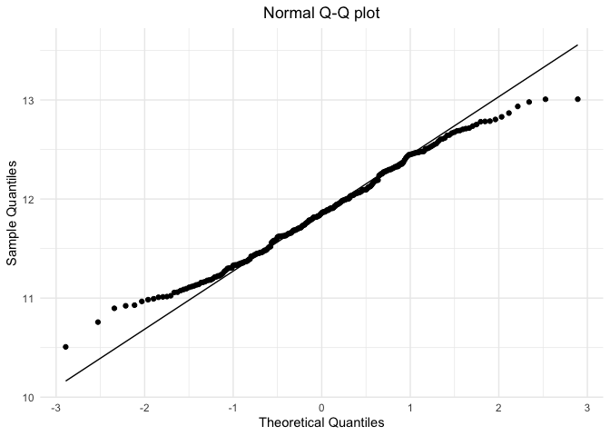
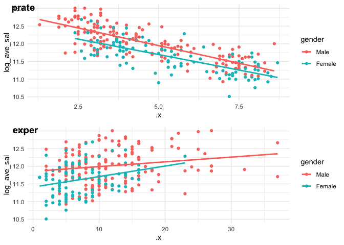

EDA
================
xj2249
2019/12/4

# clean data

``` r
law_df <- 
    read_csv("Lawsuit.csv") %>% 
    janitor::clean_names() %>% 
    select(-id) %>% 
    mutate(gender = factor(gender,labels = c("Female","Male")),
           gender = relevel(gender, ref = "Male"),
           dept = factor(dept, labels = c("bio","phy","gene","pedia","med","sur")),
           clin = factor(clin, labels = c("research","clinical")),
           cert = factor(cert, labels = c("not certified","certified")),
           rank = factor(rank,labels = c("assistant","associate","full")),
           ave_sal = (sal94 + sal95)/2
           )
```

    ## Parsed with column specification:
    ## cols(
    ##   ID = col_double(),
    ##   Dept = col_double(),
    ##   Gender = col_double(),
    ##   Clin = col_double(),
    ##   Cert = col_double(),
    ##   Prate = col_double(),
    ##   Exper = col_double(),
    ##   Rank = col_double(),
    ##   Sal94 = col_double(),
    ##   Sal95 = col_double()
    ## )

## consider transform response variable

``` r
law_df %>% 
    ggplot(aes(x = ave_sal, y = ..density..)) +
    geom_histogram() + 
    labs(title = "Distribution of salary", x = "salary")
```

    ## `stat_bin()` using `bins = 30`. Pick better value with `binwidth`.

<!-- -->

``` r
law_df %>% 
    ggplot(aes(sample = ave_sal)) + 
    stat_qq() +
    stat_qq_line() + 
    labs(title = "Normal Q-Q plot" , x = "Theoretical Quantiles", y = "Sample Quantiles")
```

<!-- -->

``` r
law_df <- 
    law_df %>% 
    mutate(log_ave_sal = log(ave_sal))

law_df %>% 
    ggplot(aes(sample = log_ave_sal)) + 
    stat_qq() +
    stat_qq_line() + 
    labs(title = "Normal Q-Q plot" , x = "Theoretical Quantiles", y = "Sample Quantiles")
```

<!-- -->

# 1\. Confounders

## 1.1 table1(covariates and outcome by gender)

``` r
# descriptive statistics for variables of interest
control_table <- tableby.control(
        total = T,
        test = F,
        numeric.stats = c("meansd","medianq1q3","range"),
        stats.labels = list(meansd = "Mean (SD)",
                            medianq1q3 = "Median (Q1, Q3)",
                            range = "Min - Max"),
        digits = 2
        ) 
# cat.stats = "countrowpct" 

law_df %>% 
        tableby(gender ~ .,
                data = .,
                control = control_table) %>% 
        summary(text = TRUE) %>% 
        kableExtra::kable(caption = "Characcteristics of college faculty")
```

<table>

<caption>

Characcteristics of college faculty

</caption>

<thead>

<tr>

<th style="text-align:left;">

</th>

<th style="text-align:left;">

Male (N=155)

</th>

<th style="text-align:left;">

Female (N=106)

</th>

<th style="text-align:left;">

Total (N=261)

</th>

</tr>

</thead>

<tbody>

<tr>

<td style="text-align:left;">

dept

</td>

<td style="text-align:left;">

</td>

<td style="text-align:left;">

</td>

<td style="text-align:left;">

</td>

</tr>

<tr>

<td style="text-align:left;">

  - bio
    </td>
    <td style="text-align:left;">
    30 (19.4%)
    </td>
    <td style="text-align:left;">
    20 (18.9%)
    </td>
    <td style="text-align:left;">
    50 (19.2%)
    </td>
    </tr>
    <tr>
    <td style="text-align:left;">
      - phy
        </td>
        <td style="text-align:left;">
        20 (12.9%)
        </td>
        <td style="text-align:left;">
        20 (18.9%)
        </td>
        <td style="text-align:left;">
        40 (15.3%)
        </td>
        </tr>
        <tr>
        <td style="text-align:left;">
          - gene
            </td>
            <td style="text-align:left;">
            10 (6.5%)
            </td>
            <td style="text-align:left;">
            11 (10.4%)
            </td>
            <td style="text-align:left;">
            21 (8.0%)
            </td>
            </tr>
            <tr>
            <td style="text-align:left;">
              - pedia
                </td>
                <td style="text-align:left;">
                10 (6.5%)
                </td>
                <td style="text-align:left;">
                20 (18.9%)
                </td>
                <td style="text-align:left;">
                30 (11.5%)
                </td>
                </tr>
                <tr>
                <td style="text-align:left;">
                  - med
                    </td>
                    <td style="text-align:left;">
                    50 (32.3%)
                    </td>
                    <td style="text-align:left;">
                    30 (28.3%)
                    </td>
                    <td style="text-align:left;">
                    80 (30.7%)
                    </td>
                    </tr>
                    <tr>
                    <td style="text-align:left;">
                      - sur
                        </td>
                        <td style="text-align:left;">
                        35 (22.6%)
                        </td>
                        <td style="text-align:left;">
                        5 (4.7%)
                        </td>
                        <td style="text-align:left;">
                        40 (15.3%)
                        </td>
                        </tr>
                        <tr>
                        <td style="text-align:left;">
                        clin
                        </td>
                        <td style="text-align:left;">
                        </td>
                        <td style="text-align:left;">
                        </td>
                        <td style="text-align:left;">
                        </td>
                        </tr>
                        <tr>
                        <td style="text-align:left;">
                          - research
                            </td>
                            <td style="text-align:left;">
                            55 (35.5%)
                            </td>
                            <td style="text-align:left;">
                            46 (43.4%)
                            </td>
                            <td style="text-align:left;">
                            101 (38.7%)
                            </td>
                            </tr>
                            <tr>
                            <td style="text-align:left;">
                              - clinical
                                </td>
                                <td style="text-align:left;">
                                100 (64.5%)
                                </td>
                                <td style="text-align:left;">
                                60 (56.6%)
                                </td>
                                <td style="text-align:left;">
                                160 (61.3%)
                                </td>
                                </tr>
                                <tr>
                                <td style="text-align:left;">
                                cert
                                </td>
                                <td style="text-align:left;">
                                </td>
                                <td style="text-align:left;">
                                </td>
                                <td style="text-align:left;">
                                </td>
                                </tr>
                                <tr>
                                <td style="text-align:left;">
                                  - not certified
                                    </td>
                                    <td style="text-align:left;">
                                    37 (23.9%)
                                    </td>
                                    <td style="text-align:left;">
                                    36 (34.0%)
                                    </td>
                                    <td style="text-align:left;">
                                    73 (28.0%)
                                    </td>
                                    </tr>
                                    <tr>
                                    <td style="text-align:left;">
                                      - certified
                                        </td>
                                        <td style="text-align:left;">
                                        118 (76.1%)
                                        </td>
                                        <td style="text-align:left;">
                                        70 (66.0%)
                                        </td>
                                        <td style="text-align:left;">
                                        188 (72.0%)
                                        </td>
                                        </tr>
                                        <tr>
                                        <td style="text-align:left;">
                                        prate
                                        </td>
                                        <td style="text-align:left;">
                                        </td>
                                        <td style="text-align:left;">
                                        </td>
                                        <td style="text-align:left;">
                                        </td>
                                        </tr>
                                        <tr>
                                        <td style="text-align:left;">
                                          - Mean
                                            (SD)
                                            </td>
                                            <td style="text-align:left;">
                                            4.65
                                            (1.94)
                                            </td>
                                            <td style="text-align:left;">
                                            5.35
                                            (1.89)
                                            </td>
                                            <td style="text-align:left;">
                                            4.93
                                            (1.94)
                                            </td>
                                            </tr>
                                            <tr>
                                            <td style="text-align:left;">
                                              - Median (Q1,
                                                Q3)
                                                </td>
                                                <td style="text-align:left;">
                                                4.00 (3.10,
                                                6.70)
                                                </td>
                                                <td style="text-align:left;">
                                                5.25 (3.73,
                                                7.27)
                                                </td>
                                                <td style="text-align:left;">
                                                4.40 (3.20,
                                                6.90)
                                                </td>
                                                </tr>
                                                <tr>
                                                <td style="text-align:left;">
                                                  - Min -
                                                    Max
                                                    </td>
                                                    <td style="text-align:left;">
                                                    1.30 -
                                                    8.60
                                                    </td>
                                                    <td style="text-align:left;">
                                                    2.40 -
                                                    8.70
                                                    </td>
                                                    <td style="text-align:left;">
                                                    1.30 -
                                                    8.70
                                                    </td>
                                                    </tr>
                                                    <tr>
                                                    <td style="text-align:left;">
                                                    exper
                                                    </td>
                                                    <td style="text-align:left;">
                                                    </td>
                                                    <td style="text-align:left;">
                                                    </td>
                                                    <td style="text-align:left;">
                                                    </td>
                                                    </tr>
                                                    <tr>
                                                    <td style="text-align:left;">
                                                      - Mean
                                                        (SD)
                                                        </td>
                                                        <td style="text-align:left;">
                                                        12.10
                                                        (6.70)
                                                        </td>
                                                        <td style="text-align:left;">
                                                        7.49
                                                        (4.17)
                                                        </td>
                                                        <td style="text-align:left;">
                                                        10.23
                                                        (6.23)
                                                        </td>
                                                        </tr>
                                                        <tr>
                                                        <td style="text-align:left;">
                                                          - Median (Q1,
                                                            Q3)
                                                            </td>
                                                            <td style="text-align:left;">
                                                            10.00 (7.00,
                                                            15.00)
                                                            </td>
                                                            <td style="text-align:left;">
                                                            7.00 (5.00,
                                                            10.00)
                                                            </td>
                                                            <td style="text-align:left;">
                                                            9.00 (6.00,
                                                            14.00)
                                                            </td>
                                                            </tr>
                                                            <tr>
                                                            <td style="text-align:left;">
                                                              - Min -
                                                                Max
                                                                </td>
                                                                <td style="text-align:left;">
                                                                2.00 -
                                                                37.00
                                                                </td>
                                                                <td style="text-align:left;">
                                                                1.00 -
                                                                23.00
                                                                </td>
                                                                <td style="text-align:left;">
                                                                1.00 -
                                                                37.00
                                                                </td>
                                                                </tr>
                                                                <tr>
                                                                <td style="text-align:left;">
                                                                rank
                                                                </td>
                                                                <td style="text-align:left;">
                                                                </td>
                                                                <td style="text-align:left;">
                                                                </td>
                                                                <td style="text-align:left;">
                                                                </td>
                                                                </tr>
                                                                <tr>
                                                                <td style="text-align:left;">
                                                                  - assistant
                                                                    </td>
                                                                    <td style="text-align:left;">
                                                                    43
                                                                    (27.7%)
                                                                    </td>
                                                                    <td style="text-align:left;">
                                                                    69
                                                                    (65.1%)
                                                                    </td>
                                                                    <td style="text-align:left;">
                                                                    112
                                                                    (42.9%)
                                                                    </td>
                                                                    </tr>
                                                                    <tr>
                                                                    <td style="text-align:left;">
                                                                      - associate
                                                                        </td>
                                                                        <td style="text-align:left;">
                                                                        43
                                                                        (27.7%)
                                                                        </td>
                                                                        <td style="text-align:left;">
                                                                        21
                                                                        (19.8%)
                                                                        </td>
                                                                        <td style="text-align:left;">
                                                                        64
                                                                        (24.5%)
                                                                        </td>
                                                                        </tr>
                                                                        <tr>
                                                                        <td style="text-align:left;">
                                                                          - full
                                                                            </td>
                                                                            <td style="text-align:left;">
                                                                            69
                                                                            (44.5%)
                                                                            </td>
                                                                            <td style="text-align:left;">
                                                                            16
                                                                            (15.1%)
                                                                            </td>
                                                                            <td style="text-align:left;">
                                                                            85
                                                                            (32.6%)
                                                                            </td>
                                                                            </tr>
                                                                            <tr>
                                                                            <td style="text-align:left;">
                                                                            sal94
                                                                            </td>
                                                                            <td style="text-align:left;">
                                                                            </td>
                                                                            <td style="text-align:left;">
                                                                            </td>
                                                                            <td style="text-align:left;">
                                                                            </td>
                                                                            </tr>
                                                                            <tr>
                                                                            <td style="text-align:left;">
                                                                              - Mean
                                                                                (SD)
                                                                                </td>
                                                                                <td style="text-align:left;">
                                                                                177338.76
                                                                                (85930.54)
                                                                                </td>
                                                                                <td style="text-align:left;">
                                                                                118871.27
                                                                                (56168.01)
                                                                                </td>
                                                                                <td style="text-align:left;">
                                                                                153593.34
                                                                                (80469.67)
                                                                                </td>
                                                                                </tr>
                                                                                <tr>
                                                                                <td style="text-align:left;">
                                                                                  - Median
                                                                                    (Q1,
                                                                                    Q3)
                                                                                    </td>
                                                                                    <td style="text-align:left;">
                                                                                    155006.00
                                                                                    (109687.00,
                                                                                    231501.50)
                                                                                    </td>
                                                                                    <td style="text-align:left;">
                                                                                    108457.00
                                                                                    (75774.50,
                                                                                    143096.00)
                                                                                    </td>
                                                                                    <td style="text-align:left;">
                                                                                    133284.00
                                                                                    (90771.00,
                                                                                    200543.00)
                                                                                    </td>
                                                                                    </tr>
                                                                                    <tr>
                                                                                    <td style="text-align:left;">
                                                                                      - Min
                                                                                        -
                                                                                        Max
                                                                                        </td>
                                                                                        <td style="text-align:left;">
                                                                                        52582.00
                                                                                        -
                                                                                        428876.00
                                                                                        </td>
                                                                                        <td style="text-align:left;">
                                                                                        34514.00
                                                                                        -
                                                                                        308081.00
                                                                                        </td>
                                                                                        <td style="text-align:left;">
                                                                                        34514.00
                                                                                        -
                                                                                        428876.00
                                                                                        </td>
                                                                                        </tr>
                                                                                        <tr>
                                                                                        <td style="text-align:left;">
                                                                                        sal95
                                                                                        </td>
                                                                                        <td style="text-align:left;">
                                                                                        </td>
                                                                                        <td style="text-align:left;">
                                                                                        </td>
                                                                                        <td style="text-align:left;">
                                                                                        </td>
                                                                                        </tr>
                                                                                        <tr>
                                                                                        <td style="text-align:left;">
                                                                                          - Mean
                                                                                            (SD)
                                                                                            </td>
                                                                                            <td style="text-align:left;">
                                                                                            194914.09
                                                                                            (94902.73)
                                                                                            </td>
                                                                                            <td style="text-align:left;">
                                                                                            130876.92
                                                                                            (62034.51)
                                                                                            </td>
                                                                                            <td style="text-align:left;">
                                                                                            168906.66
                                                                                            (88778.43)
                                                                                            </td>
                                                                                            </tr>
                                                                                            <tr>
                                                                                            <td style="text-align:left;">
                                                                                              - Median
                                                                                                (Q1,
                                                                                                Q3)
                                                                                                </td>
                                                                                                <td style="text-align:left;">
                                                                                                170967.00
                                                                                                (119952.50,
                                                                                                257163.00)
                                                                                                </td>
                                                                                                <td style="text-align:left;">
                                                                                                119135.00
                                                                                                (82345.25,
                                                                                                154170.50)
                                                                                                </td>
                                                                                                <td style="text-align:left;">
                                                                                                148117.00
                                                                                                (99972.00,
                                                                                                218955.00)
                                                                                                </td>
                                                                                                </tr>
                                                                                                <tr>
                                                                                                <td style="text-align:left;">
                                                                                                  - Min
                                                                                                    -
                                                                                                    Max
                                                                                                    </td>
                                                                                                    <td style="text-align:left;">
                                                                                                    58923.00
                                                                                                    -
                                                                                                    472589.00
                                                                                                    </td>
                                                                                                    <td style="text-align:left;">
                                                                                                    38675.00
                                                                                                    -
                                                                                                    339664.00
                                                                                                    </td>
                                                                                                    <td style="text-align:left;">
                                                                                                    38675.00
                                                                                                    -
                                                                                                    472589.00
                                                                                                    </td>
                                                                                                    </tr>
                                                                                                    <tr>
                                                                                                    <td style="text-align:left;">
                                                                                                    ave\_sal
                                                                                                    </td>
                                                                                                    <td style="text-align:left;">
                                                                                                    </td>
                                                                                                    <td style="text-align:left;">
                                                                                                    </td>
                                                                                                    <td style="text-align:left;">
                                                                                                    </td>
                                                                                                    </tr>
                                                                                                    <tr>
                                                                                                    <td style="text-align:left;">
                                                                                                      - Mean
                                                                                                        (SD)
                                                                                                        </td>
                                                                                                        <td style="text-align:left;">
                                                                                                        186126.43
                                                                                                        (90397.11)
                                                                                                        </td>
                                                                                                        <td style="text-align:left;">
                                                                                                        124874.09
                                                                                                        (59089.62)
                                                                                                        </td>
                                                                                                        <td style="text-align:left;">
                                                                                                        161250.00
                                                                                                        (84608.33)
                                                                                                        </td>
                                                                                                        </tr>
                                                                                                        <tr>
                                                                                                        <td style="text-align:left;">
                                                                                                          - Median
                                                                                                            (Q1,
                                                                                                            Q3)
                                                                                                            </td>
                                                                                                            <td style="text-align:left;">
                                                                                                            162987.00
                                                                                                            (114612.50,
                                                                                                            244332.25)
                                                                                                            </td>
                                                                                                            <td style="text-align:left;">
                                                                                                            113706.00
                                                                                                            (79059.88,
                                                                                                            148401.12)
                                                                                                            </td>
                                                                                                            <td style="text-align:left;">
                                                                                                            141628.00
                                                                                                            (95176.50,
                                                                                                            210012.50)
                                                                                                            </td>
                                                                                                            </tr>
                                                                                                            <tr>
                                                                                                            <td style="text-align:left;">
                                                                                                              - Min
                                                                                                                -
                                                                                                                Max
                                                                                                                </td>
                                                                                                                <td style="text-align:left;">
                                                                                                                55752.50
                                                                                                                -
                                                                                                                445859.00
                                                                                                                </td>
                                                                                                                <td style="text-align:left;">
                                                                                                                36594.50
                                                                                                                -
                                                                                                                323872.50
                                                                                                                </td>
                                                                                                                <td style="text-align:left;">
                                                                                                                36594.50
                                                                                                                -
                                                                                                                445859.00
                                                                                                                </td>
                                                                                                                </tr>
                                                                                                                <tr>
                                                                                                                <td style="text-align:left;">
                                                                                                                log\_ave\_sal
                                                                                                                </td>
                                                                                                                <td style="text-align:left;">
                                                                                                                </td>
                                                                                                                <td style="text-align:left;">
                                                                                                                </td>
                                                                                                                <td style="text-align:left;">
                                                                                                                </td>
                                                                                                                </tr>
                                                                                                                <tr>
                                                                                                                <td style="text-align:left;">
                                                                                                                  - Mean
                                                                                                                    (SD)
                                                                                                                    </td>
                                                                                                                    <td style="text-align:left;">
                                                                                                                    12.02
                                                                                                                    (0.49)
                                                                                                                    </td>
                                                                                                                    <td style="text-align:left;">
                                                                                                                    11.63
                                                                                                                    (0.45)
                                                                                                                    </td>
                                                                                                                    <td style="text-align:left;">
                                                                                                                    11.86
                                                                                                                    (0.51)
                                                                                                                    </td>
                                                                                                                    </tr>
                                                                                                                    <tr>
                                                                                                                    <td style="text-align:left;">
                                                                                                                      - Median
                                                                                                                        (Q1,
                                                                                                                        Q3)
                                                                                                                        </td>
                                                                                                                        <td style="text-align:left;">
                                                                                                                        12.00
                                                                                                                        (11.65,
                                                                                                                        12.41)
                                                                                                                        </td>
                                                                                                                        <td style="text-align:left;">
                                                                                                                        11.64
                                                                                                                        (11.28,
                                                                                                                        11.91)
                                                                                                                        </td>
                                                                                                                        <td style="text-align:left;">
                                                                                                                        11.86
                                                                                                                        (11.46,
                                                                                                                        12.25)
                                                                                                                        </td>
                                                                                                                        </tr>
                                                                                                                        <tr>
                                                                                                                        <td style="text-align:left;">
                                                                                                                          - Min
                                                                                                                            -
                                                                                                                            Max
                                                                                                                            </td>
                                                                                                                            <td style="text-align:left;">
                                                                                                                            10.93
                                                                                                                            -
                                                                                                                            13.01
                                                                                                                            </td>
                                                                                                                            <td style="text-align:left;">
                                                                                                                            10.51
                                                                                                                            -
                                                                                                                            12.69
                                                                                                                            </td>
                                                                                                                            <td style="text-align:left;">
                                                                                                                            10.51
                                                                                                                            -
                                                                                                                            13.01
                                                                                                                            </td>
                                                                                                                            </tr>
                                                                                                                            </tbody>
                                                                                                                            </table>

The `clin` and `cert` has a p-value \>0.05 (but \< 0.20), suggesting
that the composition of `clin` and `cert` are not very different in
female and male. But still, we will check their impact on coefficient of
female
later.

# 1.2 exploratory visualization (relationship between salary and exposure/covariate)

## 1.2.1 categorical

``` r
map(law_df[,c(1:4,7)], 
    ~ggplot(aes(y = log_ave_sal,x = .x, fill = gender),data = law_df) + geom_boxplot()) %>% 
    cowplot::plot_grid(plotlist = .,ncol = 2,labels = colnames(law_df[,c(1:4,7)]))
```

<!-- -->

``` r
dept_plot <- 
    law_df %>% 
    ggplot(aes(y = log_ave_sal,x = dept, fill = gender)) + 
    geom_boxplot() + 
    labs(x = "Department",y = "")

clin_plot <- 
    law_df %>% 
    ggplot(aes(y = log_ave_sal,x = clin, fill = gender)) + 
    geom_boxplot() + 
    labs(x = "Primary emphasis",y = "")

cert_plot <- 
    law_df %>% 
    ggplot(aes(y = log_ave_sal,x = cert, fill = gender)) + 
    geom_boxplot() + 
    labs(x = "Board certification", y = "")

rank_plot <- 
    law_df %>% 
    ggplot(aes(y = log_ave_sal,x = rank, fill = gender)) + 
    geom_boxplot() + 
    labs(x = "Rank",y = "")

gender_plot <- 
    law_df %>% 
    ggplot(aes(y = log_ave_sal,x = gender, fill = gender)) + 
    geom_boxplot() + 
    labs(x = "Gender",y = "")

figure_catg <- ggpubr::ggarrange(dept_plot,clin_plot,cert_plot,rank_plot,gender_plot,
                  common.legend = T,ncol = 2, nrow = 3,legend = "bottom")

# Annotate the figure by adding a common labels
annotate_figure(figure_catg,
                top = text_grob("Salary Distribution",face = "bold", size = 14),
                left = text_grob("log(avarage salary)",rot = 90))
```

<!-- -->

I want yo draw your attention to the `rank` plot. Seems that for male,
salary doesnt change that much from assistant to full professor. But
for female, it changes a lot.

## 1.2.2 continuous

``` r
map(law_df[,5:6], 
    ~ggplot(aes(y = log_ave_sal,x = .x, color = gender),data = law_df) + 
            geom_point() + 
            geom_smooth(method = "lm",se = F)) %>%
    cowplot::plot_grid(plotlist = .,ncol = 1,labels = colnames(law_df[,5:6]))
```

<!-- -->

``` r
prate_plot <-
    law_df %>% 
    ggplot(aes(y = log_ave_sal,x = prate, color = gender)) + 
    geom_point() + 
    geom_smooth(method = "lm",se = F) + 
    labs(title = "Salary vs Publication rate", x = "Publication rate" , y = "log(avarage salary)")


exper_plot <-
    law_df %>% 
    ggplot(aes(y = log_ave_sal,x = exper, color = gender)) + 
    geom_point() + 
    geom_smooth(method = "lm",se = F) +
    labs(title = "Salary vs Experience", x = "Years since obtaining MD", y = "log(avarage salary)")

ggarrange(prate_plot,exper_plot,ncol = 1,common.legend = T, legend = "bottom")
```

<!-- -->

We see a non-parallel(slightly) slope of `exper`, so we may consider
interaction term in our model.

## 1.3 Adjusted vs crude coefficients of female.

``` r
crude <- 
    lm(log_ave_sal ~ gender, data = law_df) %>% 
    broom::tidy() %>% 
    filter(term == "genderFemale") %>% 
    pull(estimate)

adj <-
    law_df %>% 
    select(dept,clin,cert,prate,exper,rank) %>% 
    map(~lm(log_ave_sal ~ gender + .x, data = law_df) %>% broom::tidy()) %>% 
    map_dbl(~filter(.x,term == "genderFemale") %>% pull(estimate)) 

change <- round(100*(crude - adj)/crude,digits = 2)
change
```

    ##  dept  clin  cert prate exper  rank 
    ## 46.74 12.49 13.61 34.65 20.18  9.30

Rule of thumb, these covariate can all be confounders. (?)

# 2\. Interaction:only consider two-way for now

First, I think its ok(or not wrong) not to include interaction in our
model. Buts its interesting to explore the
interaction

# 3.Multiple linear regression model

## 3.1 without any interaction

``` r
full <- lm(log_ave_sal ~ gender + dept + clin + cert + prate + exper + rank, data = law_df) 
summary(full)
```

    ## 
    ## Call:
    ## lm(formula = log_ave_sal ~ gender + dept + clin + cert + prate + 
    ##     exper + rank, data = law_df)
    ## 
    ## Residuals:
    ##      Min       1Q   Median       3Q      Max 
    ## -0.33729 -0.07685 -0.01218  0.07599  0.89829 
    ## 
    ## Coefficients:
    ##                Estimate Std. Error t value Pr(>|t|)    
    ## (Intercept)   11.160406   0.130732  85.369  < 2e-16 ***
    ## genderFemale  -0.019536   0.020224  -0.966  0.33500    
    ## deptphy       -0.175521   0.029090  -6.034 5.80e-09 ***
    ## deptgene       0.169395   0.038791   4.367 1.85e-05 ***
    ## deptpedia      0.153235   0.053632   2.857  0.00464 ** 
    ## deptmed        0.496297   0.045284  10.960  < 2e-16 ***
    ## deptsur        0.870767   0.061638  14.127  < 2e-16 ***
    ## clinclinical   0.164726   0.041145   4.004 8.25e-05 ***
    ## certcertified  0.190855   0.021238   8.987  < 2e-16 ***
    ## prate         -0.021730   0.017367  -1.251  0.21203    
    ## exper          0.018027   0.001826   9.873  < 2e-16 ***
    ## rankassociate  0.132488   0.023595   5.615 5.25e-08 ***
    ## rankfull       0.219399   0.026316   8.337 5.28e-15 ***
    ## ---
    ## Signif. codes:  0 '***' 0.001 '**' 0.01 '*' 0.05 '.' 0.1 ' ' 1
    ## 
    ## Residual standard error: 0.1335 on 248 degrees of freedom
    ## Multiple R-squared:  0.9343, Adjusted R-squared:  0.9311 
    ## F-statistic: 293.9 on 12 and 248 DF,  p-value: < 2.2e-16

``` r
par(mfrow = c(2,2))
plot(full)
```

<!-- -->

``` r
HH::vif(full)
```

    ##  genderFemale       deptphy      deptgene     deptpedia       deptmed 
    ##      1.443762      1.607184      1.629419      4.282664      6.379551 
    ##       deptsur  clinclinical certcertified         prate         exper 
    ##      7.215586      5.877635      1.329952     16.626048      1.884661 
    ## rankassociate      rankfull 
    ##      1.508016      2.225837

``` r
full <- lm(log_ave_sal ~ gender + dept + clin + cert  + exper + rank, data = law_df) 
```

Ah. May be there is no obvious discrimination. (coz these confouders
maybe actually mediators.)

## stepwise(not sure if necessary)

``` r
lower_gender <- lm(log_ave_sal ~ gender, data = law_df) 
step(full,scope = list(lower = lower_gender))
```

    ## Start:  AIC=-1038.66
    ## log_ave_sal ~ gender + dept + clin + cert + exper + rank
    ## 
    ##         Df Sum of Sq     RSS      AIC
    ## <none>                4.4506 -1038.66
    ## - rank   2    1.3087  5.7592  -975.38
    ## - cert   1    1.4260  5.8766  -968.12
    ## - clin   1    1.6198  6.0704  -959.65
    ## - exper  1    1.7105  6.1611  -955.78
    ## - dept   5   21.7719 26.2225  -585.75

    ## 
    ## Call:
    ## lm(formula = log_ave_sal ~ gender + dept + clin + cert + exper + 
    ##     rank, data = law_df)
    ## 
    ## Coefficients:
    ##   (Intercept)   genderFemale        deptphy       deptgene      deptpedia  
    ##      11.00154       -0.02576       -0.17575        0.18597        0.20335  
    ##       deptmed        deptsur   clinclinical  certcertified          exper  
    ##       0.53930        0.93382        0.20834        0.18975        0.01773  
    ## rankassociate       rankfull  
    ##       0.13466        0.22221

``` r
model_stepwise <- lm(log_ave_sal ~ gender + dept + clin + cert + exper + rank, data = law_df) 
summary(model_stepwise )
```

    ## 
    ## Call:
    ## lm(formula = log_ave_sal ~ gender + dept + clin + cert + exper + 
    ##     rank, data = law_df)
    ## 
    ## Residuals:
    ##      Min       1Q   Median       3Q      Max 
    ## -0.34605 -0.07696 -0.01873  0.07596  0.90393 
    ## 
    ## Coefficients:
    ##                Estimate Std. Error t value Pr(>|t|)    
    ## (Intercept)   11.001536   0.031160 353.069  < 2e-16 ***
    ## genderFemale  -0.025763   0.019624  -1.313     0.19    
    ## deptphy       -0.175749   0.029122  -6.035 5.73e-09 ***
    ## deptgene       0.185970   0.036501   5.095 6.90e-07 ***
    ## deptpedia      0.203345   0.035712   5.694 3.48e-08 ***
    ## deptmed        0.539304   0.029515  18.272  < 2e-16 ***
    ## deptsur        0.933820   0.035533  26.280  < 2e-16 ***
    ## clinclinical   0.208340   0.021885   9.520  < 2e-16 ***
    ## certcertified  0.189749   0.021244   8.932  < 2e-16 ***
    ## exper          0.017726   0.001812   9.783  < 2e-16 ***
    ## rankassociate  0.134663   0.023557   5.716 3.10e-08 ***
    ## rankfull       0.222214   0.026249   8.466 2.22e-15 ***
    ## ---
    ## Signif. codes:  0 '***' 0.001 '**' 0.01 '*' 0.05 '.' 0.1 ' ' 1
    ## 
    ## Residual standard error: 0.1337 on 249 degrees of freedom
    ## Multiple R-squared:  0.9339, Adjusted R-squared:  0.931 
    ## F-statistic: 319.7 on 11 and 249 DF,  p-value: < 2.2e-16

## 3.2 with some interaction

``` r
inter1 <- lm(log_ave_sal ~ gender + dept +clin + cert  +  gender*exper + gender*rank,data = law_df) 

summary(inter1 )
```

    ## 
    ## Call:
    ## lm(formula = log_ave_sal ~ gender + dept + clin + cert + gender * 
    ##     exper + gender * rank, data = law_df)
    ## 
    ## Residuals:
    ##      Min       1Q   Median       3Q      Max 
    ## -0.31795 -0.07929 -0.01275  0.07078  0.85987 
    ## 
    ## Coefficients:
    ##                             Estimate Std. Error t value Pr(>|t|)    
    ## (Intercept)                11.039463   0.033350 331.021  < 2e-16 ***
    ## genderFemale               -0.133412   0.038125  -3.499 0.000554 ***
    ## deptphy                    -0.166053   0.028962  -5.733 2.87e-08 ***
    ## deptgene                    0.188370   0.035963   5.238 3.49e-07 ***
    ## deptpedia                   0.219621   0.035606   6.168 2.82e-09 ***
    ## deptmed                     0.548131   0.029218  18.760  < 2e-16 ***
    ## deptsur                     0.939254   0.035170  26.706  < 2e-16 ***
    ## clinclinical                0.205465   0.022327   9.203  < 2e-16 ***
    ## certcertified               0.181479   0.021644   8.385 3.97e-15 ***
    ## exper                       0.016378   0.001965   8.334 5.54e-15 ***
    ## rankassociate               0.101222   0.031438   3.220 0.001456 ** 
    ## rankfull                    0.198141   0.032888   6.025 6.14e-09 ***
    ## genderFemale:exper          0.010471   0.004719   2.219 0.027410 *  
    ## genderFemale:rankassociate  0.040275   0.048384   0.832 0.405994    
    ## genderFemale:rankfull       0.018879   0.060486   0.312 0.755215    
    ## ---
    ## Signif. codes:  0 '***' 0.001 '**' 0.01 '*' 0.05 '.' 0.1 ' ' 1
    ## 
    ## Residual standard error: 0.1315 on 246 degrees of freedom
    ## Multiple R-squared:  0.9368, Adjusted R-squared:  0.9332 
    ## F-statistic: 260.5 on 14 and 246 DF,  p-value: < 2.2e-16

``` r
inter2 <- lm(log_ave_sal ~ gender + dept +clin + cert  +  gender*exper + rank,data = law_df) 
summary(inter2)
```

    ## 
    ## Call:
    ## lm(formula = log_ave_sal ~ gender + dept + clin + cert + gender * 
    ##     exper + rank, data = law_df)
    ## 
    ## Residuals:
    ##      Min       1Q   Median       3Q      Max 
    ## -0.32130 -0.07860 -0.00987  0.07100  0.86910 
    ## 
    ## Coefficients:
    ##                    Estimate Std. Error t value Pr(>|t|)    
    ## (Intercept)        11.03226    0.03197 345.034  < 2e-16 ***
    ## genderFemale       -0.12893    0.03691  -3.493 0.000566 ***
    ## deptphy            -0.16507    0.02875  -5.741 2.75e-08 ***
    ## deptgene            0.18977    0.03583   5.297 2.60e-07 ***
    ## deptpedia           0.21860    0.03534   6.185 2.54e-09 ***
    ## deptmed             0.54677    0.02905  18.825  < 2e-16 ***
    ## deptsur             0.93983    0.03491  26.924  < 2e-16 ***
    ## clinclinical        0.20817    0.02147   9.696  < 2e-16 ***
    ## certcertified       0.18217    0.02097   8.688 5.09e-16 ***
    ## exper               0.01605    0.00185   8.672 5.64e-16 ***
    ## rankassociate       0.11823    0.02365   5.000 1.09e-06 ***
    ## rankfull            0.20804    0.02611   7.967 5.90e-14 ***
    ## genderFemale:exper  0.01173    0.00358   3.276 0.001204 ** 
    ## ---
    ## Signif. codes:  0 '***' 0.001 '**' 0.01 '*' 0.05 '.' 0.1 ' ' 1
    ## 
    ## Residual standard error: 0.1312 on 248 degrees of freedom
    ## Multiple R-squared:  0.9366, Adjusted R-squared:  0.9336 
    ## F-statistic: 305.4 on 12 and 248 DF,  p-value: < 2.2e-16

``` r
lm(log_ave_sal ~ gender + dept +clin + cert  +  gender*exper + rank,data = law_df) %>% summary()
```

    ## 
    ## Call:
    ## lm(formula = log_ave_sal ~ gender + dept + clin + cert + gender * 
    ##     exper + rank, data = law_df)
    ## 
    ## Residuals:
    ##      Min       1Q   Median       3Q      Max 
    ## -0.32130 -0.07860 -0.00987  0.07100  0.86910 
    ## 
    ## Coefficients:
    ##                    Estimate Std. Error t value Pr(>|t|)    
    ## (Intercept)        11.03226    0.03197 345.034  < 2e-16 ***
    ## genderFemale       -0.12893    0.03691  -3.493 0.000566 ***
    ## deptphy            -0.16507    0.02875  -5.741 2.75e-08 ***
    ## deptgene            0.18977    0.03583   5.297 2.60e-07 ***
    ## deptpedia           0.21860    0.03534   6.185 2.54e-09 ***
    ## deptmed             0.54677    0.02905  18.825  < 2e-16 ***
    ## deptsur             0.93983    0.03491  26.924  < 2e-16 ***
    ## clinclinical        0.20817    0.02147   9.696  < 2e-16 ***
    ## certcertified       0.18217    0.02097   8.688 5.09e-16 ***
    ## exper               0.01605    0.00185   8.672 5.64e-16 ***
    ## rankassociate       0.11823    0.02365   5.000 1.09e-06 ***
    ## rankfull            0.20804    0.02611   7.967 5.90e-14 ***
    ## genderFemale:exper  0.01173    0.00358   3.276 0.001204 ** 
    ## ---
    ## Signif. codes:  0 '***' 0.001 '**' 0.01 '*' 0.05 '.' 0.1 ' ' 1
    ## 
    ## Residual standard error: 0.1312 on 248 degrees of freedom
    ## Multiple R-squared:  0.9366, Adjusted R-squared:  0.9336 
    ## F-statistic: 305.4 on 12 and 248 DF,  p-value: < 2.2e-16

``` r
lm(log_ave_sal ~ gender + dept +clin + cert  +  gender*exper + rank,data = law_df[-184,]) %>% summary()
```

    ## 
    ## Call:
    ## lm(formula = log_ave_sal ~ gender + dept + clin + cert + gender * 
    ##     exper + rank, data = law_df[-184, ])
    ## 
    ## Residuals:
    ##      Min       1Q   Median       3Q      Max 
    ## -0.32984 -0.07244 -0.01281  0.08040  0.28101 
    ## 
    ## Coefficients:
    ##                     Estimate Std. Error t value Pr(>|t|)    
    ## (Intercept)        10.999190   0.029181 376.926  < 2e-16 ***
    ## genderFemale       -0.098036   0.033558  -2.921  0.00381 ** 
    ## deptphy            -0.172456   0.025967  -6.641 1.96e-10 ***
    ## deptgene            0.183945   0.032339   5.688 3.62e-08 ***
    ## deptpedia           0.199326   0.031994   6.230 2.00e-09 ***
    ## deptmed             0.519788   0.026450  19.652  < 2e-16 ***
    ## deptsur             0.922498   0.031583  29.209  < 2e-16 ***
    ## clinclinical        0.226087   0.019518  11.584  < 2e-16 ***
    ## certcertified       0.199022   0.019052  10.446  < 2e-16 ***
    ## exper               0.016903   0.001673  10.101  < 2e-16 ***
    ## rankassociate       0.131614   0.021413   6.146 3.16e-09 ***
    ## rankfull            0.216546   0.023590   9.179  < 2e-16 ***
    ## genderFemale:exper  0.009676   0.003242   2.984  0.00313 ** 
    ## ---
    ## Signif. codes:  0 '***' 0.001 '**' 0.01 '*' 0.05 '.' 0.1 ' ' 1
    ## 
    ## Residual standard error: 0.1184 on 247 degrees of freedom
    ## Multiple R-squared:  0.9483, Adjusted R-squared:  0.9458 
    ## F-statistic: 377.6 on 12 and 247 DF,  p-value: < 2.2e-16

``` r
 lm(log_ave_sal ~ gender + dept +clin + cert  +  exper ,data = law_df %>% filter(rank == "assistant")) %>% summary()
```

    ## 
    ## Call:
    ## lm(formula = log_ave_sal ~ gender + dept + clin + cert + exper, 
    ##     data = law_df %>% filter(rank == "assistant"))
    ## 
    ## Residuals:
    ##      Min       1Q   Median       3Q      Max 
    ## -0.30995 -0.09230 -0.01370  0.07692  0.78854 
    ## 
    ## Coefficients:
    ##                Estimate Std. Error t value Pr(>|t|)    
    ## (Intercept)   11.041404   0.067834 162.770  < 2e-16 ***
    ## genderFemale  -0.082656   0.035347  -2.338 0.021316 *  
    ## deptphy       -0.201314   0.063379  -3.176 0.001973 ** 
    ## deptgene       0.143432   0.069186   2.073 0.040681 *  
    ## deptpedia      0.255421   0.066715   3.829 0.000223 ***
    ## deptmed        0.600806   0.061033   9.844  < 2e-16 ***
    ## deptsur        0.943082   0.070044  13.464  < 2e-16 ***
    ## clinclinical   0.179071   0.042166   4.247 4.80e-05 ***
    ## certcertified  0.119828   0.040890   2.931 0.004176 ** 
    ## exper          0.024735   0.005354   4.620 1.12e-05 ***
    ## ---
    ## Signif. codes:  0 '***' 0.001 '**' 0.01 '*' 0.05 '.' 0.1 ' ' 1
    ## 
    ## Residual standard error: 0.1541 on 102 degrees of freedom
    ## Multiple R-squared:  0.9126, Adjusted R-squared:  0.9049 
    ## F-statistic: 118.3 on 9 and 102 DF,  p-value: < 2.2e-16

``` r
a <- lm(log_ave_sal ~ gender + dept +clin + cert  +  rank ,data = law_df %>% filter(exper %in% c(0:6))) 
par(mfrow = c(2,2))
plot(inter2)
```

<!-- -->

``` r
summary(law_df$exper)
```

    ##    Min. 1st Qu.  Median    Mean 3rd Qu.    Max. 
    ##    1.00    6.00    9.00   10.23   14.00   37.00

``` r
hist(law_df$exper)
```

<!-- -->
