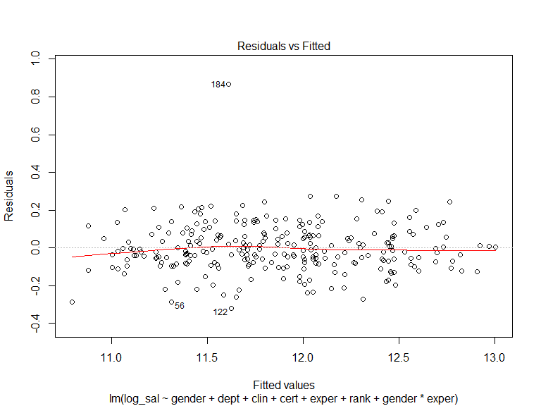
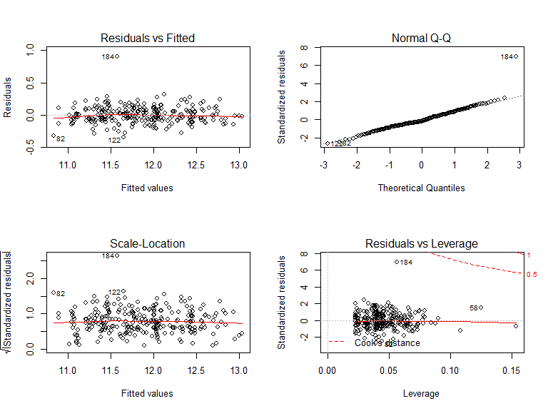

results
================
Qi Yuchen
2019/12/11

# Data cleaning

``` r
# import
df = read_csv("Lawsuit.csv") %>% 
  janitor::clean_names() %>% 
  mutate(dept = factor(dept, levels = c(1:6), labels = c("Biochemistry/Molecular Biology", "Physiology ", "Genetics", "Pediatrics", "Medicine", "Surgery")),
         gender = factor(gender, levels = c(0, 1), labels = c("female","male")),
         clin = factor(clin, levels = c(1, 0), labels = c("clinical","research")),
         cert = factor(cert, levels = c(1, 0), labels = c("certified","not_certified")),
         rank = factor(rank, levels = c(1, 2, 3), labels = c("assistant", "associate", "full")),
         sal = (sal94 + sal95)/2)
```

    ## Parsed with column specification:
    ## cols(
    ##   ID = col_double(),
    ##   Dept = col_double(),
    ##   Gender = col_double(),
    ##   Clin = col_double(),
    ##   Cert = col_double(),
    ##   Prate = col_double(),
    ##   Exper = col_double(),
    ##   Rank = col_double(),
    ##   Sal94 = col_double(),
    ##   Sal95 = col_double()
    ## )

``` r
# consider log mean sal only 
df_sal = df %>%   
  mutate(log_sal = log(sal)) %>% 
  dplyr::select(-sal95, -id, -sal94, -sal)
```

# Data exploration

## distribution of the outcome

From the distribution of average salary we applied log transformation to
the response variable.

## table1(covariates and outcome by gender)

## visualizing the relationship between response variable and predictor variables by gender

see EDA

# Model

## main effects

### Confounders

First we consider confounders.

We check the adjusted and crude coefficients of gendermale.

``` r
crude <- 
    lm(log_sal ~ gender, data = df_sal) %>% 
    broom::tidy() %>% 
    filter(term == "gendermale") %>% 
    pull(estimate)

adj <-
    df_sal %>% 
    dplyr::select(dept,clin,cert,prate,exper,rank) %>% 
    map(~lm(log_sal ~ gender + .x, data = df_sal) %>% broom::tidy()) %>% 
    map_dbl(~filter(.x,term == "gendermale") %>% pull(estimate)) 

change <- round(100*(crude - adj)/crude,digits = 2)
change
```

    ##  dept  clin  cert prate exper  rank 
    ## 46.74 12.49 13.61 34.65 20.18  9.30

As the magtitude of each coefficient change is around or larger than
10%, all covariates may be confounders.Then we inlcude them all in the
model.

### Use VIF to see collinearity

``` r
full = lm(log_sal ~ ., data = df_sal)

vif(full)
```

    ##   deptPhysiology       deptGenetics    deptPediatrics      deptMedicine 
    ##          1.607184          1.629419          4.282664          6.379551 
    ##       deptSurgery        gendermale      clinresearch certnot_certified 
    ##          7.215586          1.443762          5.877635          1.329952 
    ##             prate             exper     rankassociate          rankfull 
    ##         16.626048          1.884661          1.508016          2.225837

Since prate’s VIF is more than 10, we may drop it.

``` r
fit = lm(log_sal ~gender+dept+clin+cert+exper+rank, data = df_sal)

vif(fit)
```

    ##        gendermale   deptPhysiology       deptGenetics    deptPediatrics 
    ##          1.356319          1.607121          1.439383          1.894530 
    ##      deptMedicine       deptSurgery      clinresearch certnot_certified 
    ##          2.704003          2.392543          1.659126          1.327650 
    ##             exper     rankassociate          rankfull 
    ##          1.852094          1.499835          2.209568

``` r
anova(fit, full)
```

    ## Analysis of Variance Table
    ## 
    ## Model 1: log_sal ~ gender + dept + clin + cert + exper + rank
    ## Model 2: log_sal ~ dept + gender + clin + cert + prate + exper + rank
    ##   Res.Df    RSS Df Sum of Sq      F Pr(>F)
    ## 1    249 4.4506                           
    ## 2    248 4.4226  1  0.027919 1.5655  0.212

Now each VIF \< 5, which is good. F test also indicates no prate.

### Criteria

``` r
best_1 <- function(model, ...) 
{
  subsets <- regsubsets(formula(model), model.frame(model), method = "exhaustive", nvmax = NULL, force.in = "gendermale",  ...)
  subsets <- with(summary(subsets),
                  cbind(p = as.numeric(rownames(which)), which, rss, rsq, adjr2, cp, bic))
  
  return(subsets)
}  


best_1(full) 
```

    ##     p (Intercept) gendermale deptPhysiology  deptGenetics deptPediatrics
    ## 2   2           1          1               0            0              0
    ## 3   3           1          1               0            0              0
    ## 4   4           1          1               0            0              0
    ## 5   5           1          1               0            0              0
    ## 6   6           1          1               0            0              0
    ## 7   7           1          1               1            0              0
    ## 8   8           1          1               1            0              0
    ## 9   9           1          1               1            0              0
    ## 10 10           1          1               1            1              0
    ## 11 11           1          1               1            1              1
    ## 12 12           1          1               1            1              1
    ##    deptMedicine deptSurgery clinresearch certnot_certified prate exper
    ## 2             0           0            0                 0     1     0
    ## 3             0           0            0                 0     1     1
    ## 4             0           1            0                 0     1     1
    ## 5             1           1            0                 0     1     1
    ## 6             1           1            0                 1     1     1
    ## 7             1           1            0                 1     1     1
    ## 8             1           1            0                 1     1     1
    ## 9             1           1            0                 1     1     1
    ## 10            1           1            0                 1     1     1
    ## 11            1           1            1                 1     0     1
    ## 12            1           1            1                 1     1     1
    ##    rankassociate rankfull       rss       rsq     adjr2         cp
    ## 2              0        0 23.703015 0.6478853 0.6451557 1074.14809
    ## 3              0        0 16.097486 0.7608675 0.7580761  649.66754
    ## 4              0        0 12.931673 0.8078965 0.8048949  474.14438
    ## 5              0        0  8.397277 0.8752562 0.8728102  221.87785
    ## 6              0        0  7.073319 0.8949239 0.8924418  149.63681
    ## 7              0        0  6.164244 0.9084285 0.9058949  100.66037
    ## 8              0        1  5.469143 0.9187544 0.9161752   63.68255
    ## 9              1        1  4.987137 0.9259147 0.9232583   38.65405
    ## 10             1        1  4.724448 0.9298171 0.9270097   25.92371
    ## 11             1        1  4.450562 0.9338857 0.9309650   12.56554
    ## 12             1        1  4.422643 0.9343004 0.9311214   13.00000
    ##          bic
    ## 2  -255.7378
    ## 3  -351.1644
    ## 4  -402.7546
    ## 5  -509.8826
    ## 6  -549.0998
    ## 7  -579.4396
    ## 8  -605.1020
    ## 9  -623.6173
    ## 10 -632.1759
    ## 11 -642.1984
    ## 12 -638.2763

``` r
subsets = regsubsets(formula(full), model.frame(full), method = "exhaustive", nvmax = NULL, force.in = "gendermale")

# add interaction

fit_int = lm(log_sal ~gender+dept+clin+cert+exper+prate+gender*dept+gender*clin+gender*cert+gender*exper+gender*rank+gender*prate, data = df_sal)
best_1(fit_int)
```

    ##     p (Intercept) gendermale deptPhysiology  deptGenetics deptPediatrics
    ## 2   2           1          1               0            0              0
    ## 3   3           1          1               0            0              0
    ## 4   4           1          1               0            0              0
    ## 5   5           1          1               0            0              0
    ## 6   6           1          1               0            0              0
    ## 7   7           1          1               1            0              0
    ## 8   8           1          1               1            0              0
    ## 9   9           1          1               1            0              0
    ## 10 10           1          1               1            1              0
    ## 11 11           1          1               1            1              1
    ## 12 12           1          1               1            1              1
    ## 13 13           1          1               1            1              1
    ## 14 14           1          1               1            1              1
    ## 15 15           1          1               1            1              1
    ## 16 16           1          1               1            1              1
    ## 17 17           1          1               1            1              1
    ## 18 18           1          1               1            1              1
    ## 19 19           1          1               1            1              1
    ## 20 20           1          1               1            1              1
    ## 21 21           1          1               1            1              1
    ## 22 22           1          1               1            1              1
    ## 23 23           1          1               1            1              1
    ##    deptMedicine deptSurgery clinresearch certnot_certified exper prate
    ## 2             0           0            0                 0     0     1
    ## 3             0           0            0                 0     1     1
    ## 4             0           1            0                 0     1     1
    ## 5             1           1            0                 0     1     1
    ## 6             1           1            0                 1     1     1
    ## 7             1           1            0                 1     1     1
    ## 8             1           1            0                 1     1     1
    ## 9             1           1            0                 1     1     1
    ## 10            1           1            0                 1     1     1
    ## 11            1           1            1                 1     1     0
    ## 12            1           1            1                 1     1     0
    ## 13            1           1            1                 1     1     0
    ## 14            1           1            1                 1     1     1
    ## 15            1           1            1                 1     1     1
    ## 16            1           1            1                 1     1     1
    ## 17            1           1            1                 1     1     1
    ## 18            1           1            1                 1     1     1
    ## 19            1           1            1                 1     1     1
    ## 20            1           1            1                 1     1     1
    ## 21            1           1            1                 1     1     1
    ## 22            1           1            1                 1     1     1
    ## 23            1           1            1                 1     1     1
    ##    rankassociate rankfull gendermale:deptPhysiology 
    ## 2              0        0                          0
    ## 3              0        0                          0
    ## 4              0        0                          0
    ## 5              0        0                          0
    ## 6              0        0                          0
    ## 7              0        0                          0
    ## 8              0        1                          0
    ## 9              1        1                          0
    ## 10             1        1                          0
    ## 11             1        1                          0
    ## 12             1        1                          0
    ## 13             1        1                          0
    ## 14             1        1                          0
    ## 15             1        1                          0
    ## 16             1        1                          1
    ## 17             1        1                          1
    ## 18             1        1                          1
    ## 19             1        1                          1
    ## 20             1        1                          1
    ## 21             1        1                          1
    ## 22             1        1                          1
    ## 23             1        1                          1
    ##    gendermale:deptGenetics gendermale:deptPediatrics
    ## 2                        0                         0
    ## 3                        0                         0
    ## 4                        0                         0
    ## 5                        0                         0
    ## 6                        0                         0
    ## 7                        0                         0
    ## 8                        0                         0
    ## 9                        0                         0
    ## 10                       0                         0
    ## 11                       0                         0
    ## 12                       0                         0
    ## 13                       0                         0
    ## 14                       0                         0
    ## 15                       0                         0
    ## 16                       0                         0
    ## 17                       1                         0
    ## 18                       1                         0
    ## 19                       1                         0
    ## 20                       1                         1
    ## 21                       1                         1
    ## 22                       1                         1
    ## 23                       1                         1
    ##    gendermale:deptMedicine gendermale:deptSurgery gendermale:clinresearch
    ## 2                        0                      0                       0
    ## 3                        0                      0                       0
    ## 4                        0                      0                       0
    ## 5                        0                      0                       0
    ## 6                        0                      0                       0
    ## 7                        0                      0                       0
    ## 8                        0                      0                       0
    ## 9                        0                      0                       0
    ## 10                       0                      0                       0
    ## 11                       0                      0                       0
    ## 12                       0                      0                       0
    ## 13                       0                      0                       1
    ## 14                       0                      0                       1
    ## 15                       0                      0                       1
    ## 16                       0                      0                       1
    ## 17                       0                      0                       1
    ## 18                       0                      0                       1
    ## 19                       0                      0                       1
    ## 20                       1                      1                       0
    ## 21                       1                      1                       0
    ## 22                       1                      1                       0
    ## 23                       1                      1                       1
    ##    gendermale:certnot_certified gendermale:exper gendermale:rankassociate
    ## 2                             0                0                        0
    ## 3                             0                0                        0
    ## 4                             0                0                        0
    ## 5                             0                0                        0
    ## 6                             0                0                        0
    ## 7                             0                0                        0
    ## 8                             0                0                        0
    ## 9                             0                0                        0
    ## 10                            0                0                        0
    ## 11                            0                0                        0
    ## 12                            0                1                        0
    ## 13                            0                1                        0
    ## 14                            0                1                        0
    ## 15                            0                1                        1
    ## 16                            0                1                        1
    ## 17                            0                1                        1
    ## 18                            1                1                        1
    ## 19                            1                1                        1
    ## 20                            0                1                        1
    ## 21                            1                1                        1
    ## 22                            1                1                        1
    ## 23                            1                1                        1
    ##    gendermale:rankfull gendermale:prate       rss       rsq     adjr2
    ## 2                    0                0 23.703015 0.6478853 0.6451557
    ## 3                    0                0 16.097486 0.7608675 0.7580761
    ## 4                    0                0 12.931673 0.8078965 0.8048949
    ## 5                    0                0  8.397277 0.8752562 0.8728102
    ## 6                    0                0  7.073319 0.8949239 0.8924418
    ## 7                    0                0  6.164244 0.9084285 0.9058949
    ## 8                    0                0  5.469143 0.9187544 0.9161752
    ## 9                    0                0  4.987137 0.9259147 0.9232583
    ## 10                   0                0  4.724448 0.9298171 0.9270097
    ## 11                   0                0  4.450562 0.9338857 0.9309650
    ## 12                   0                0  4.265977 0.9366278 0.9335614
    ## 13                   0                0  4.226133 0.9372197 0.9339154
    ## 14                   0                0  4.201395 0.9375871 0.9340352
    ## 15                   0                0  4.186764 0.9378045 0.9339966
    ## 16                   0                0  4.176169 0.9379619 0.9338938
    ## 17                   0                0  4.165282 0.9381236 0.9337948
    ## 18                   0                0  4.156955 0.9382473 0.9336541
    ## 19                   1                0  4.155045 0.9382757 0.9334095
    ## 20                   0                1  4.142562 0.9384611 0.9333329
    ## 21                   0                1  4.139394 0.9385082 0.9331051
    ## 22                   1                1  4.137467 0.9385368 0.9328553
    ## 23                   1                1  4.137269 0.9385397 0.9325752
    ##             cp       bic
    ## 2  1102.807339 -255.7378
    ## 3   669.130965 -351.1644
    ## 4   489.780033 -402.7546
    ## 5   232.030976 -509.8826
    ## 6   158.189136 -549.0998
    ## 7   108.113542 -579.4396
    ## 8    70.295277 -605.1020
    ## 9    44.683982 -623.6173
    ## 10   31.636022 -632.1759
    ## 11   17.946702 -642.1984
    ## 12    9.372932 -647.6896
    ## 13    9.090458 -644.5743
    ## 14    9.673400 -640.5420
    ## 15   10.835275 -635.8880
    ## 16   12.228352 -630.9848
    ## 17   13.604659 -626.1016
    ## 18   15.127711 -621.0593
    ## 19   17.018269 -615.6148
    ## 20   18.303182 -610.8356
    ## 21   20.121708 -605.4707
    ## 22   22.011309 -600.0277
    ## 23   24.000000 -594.4757

``` r
fit_optimal = lm(log_sal ~gender+dept+clin+cert+exper+gender*clin+gender*exper, data = df_sal)
summary(fit_optimal)
```

    ## 
    ## Call:
    ## lm(formula = log_sal ~ gender + dept + clin + cert + exper + 
    ##     gender * clin + gender * exper, data = df_sal)
    ## 
    ## Residuals:
    ##      Min       1Q   Median       3Q      Max 
    ## -0.35192 -0.09065 -0.00500  0.08881  0.77991 
    ## 
    ## Coefficients:
    ##                          Estimate Std. Error t value Pr(>|t|)    
    ## (Intercept)             11.273377   0.045622 247.104  < 2e-16 ***
    ## gendermale               0.166947   0.040571   4.115 5.27e-05 ***
    ## deptPhysiology          -0.142009   0.031436  -4.517 9.67e-06 ***
    ## deptGenetics             0.212877   0.039762   5.354 1.96e-07 ***
    ## deptPediatrics           0.216747   0.038482   5.632 4.79e-08 ***
    ## deptMedicine             0.542406   0.031826  17.043  < 2e-16 ***
    ## deptSurgery              0.935610   0.038576  24.253  < 2e-16 ***
    ## clinresearch            -0.274459   0.030797  -8.912  < 2e-16 ***
    ## certnot_certified       -0.181843   0.022805  -7.974 5.58e-14 ***
    ## exper                    0.040964   0.003482  11.765  < 2e-16 ***
    ## gendermale:clinresearch  0.127953   0.038569   3.318  0.00104 ** 
    ## gendermale:exper        -0.018000   0.003844  -4.683 4.65e-06 ***
    ## ---
    ## Signif. codes:  0 '***' 0.001 '**' 0.01 '*' 0.05 '.' 0.1 ' ' 1
    ## 
    ## Residual standard error: 0.1436 on 249 degrees of freedom
    ## Multiple R-squared:  0.9237, Adjusted R-squared:  0.9203 
    ## F-statistic:   274 on 11 and 249 DF,  p-value: < 2.2e-16

So is using criteria. If force in gender, the best is without prate.
clin and exper interaction will be selected if add interaction terms.

## interaction term (not sure whether to test)

``` r
## general test 

# no prate
fit_conf = lm(log_sal ~gender+dept+clin+cert+exper+rank, data = df_sal)
summary(fit_conf)
```

    ## 
    ## Call:
    ## lm(formula = log_sal ~ gender + dept + clin + cert + exper + 
    ##     rank, data = df_sal)
    ## 
    ## Residuals:
    ##      Min       1Q   Median       3Q      Max 
    ## -0.34605 -0.07696 -0.01873  0.07596  0.90393 
    ## 
    ## Coefficients:
    ##                    Estimate Std. Error t value Pr(>|t|)    
    ## (Intercept)       11.373862   0.034398 330.651  < 2e-16 ***
    ## gendermale         0.025763   0.019624   1.313     0.19    
    ## deptPhysiology    -0.175749   0.029122  -6.035 5.73e-09 ***
    ## deptGenetics       0.185970   0.036501   5.095 6.90e-07 ***
    ## deptPediatrics     0.203345   0.035712   5.694 3.48e-08 ***
    ## deptMedicine       0.539304   0.029515  18.272  < 2e-16 ***
    ## deptSurgery        0.933820   0.035533  26.280  < 2e-16 ***
    ## clinresearch      -0.208340   0.021885  -9.520  < 2e-16 ***
    ## certnot_certified -0.189749   0.021244  -8.932  < 2e-16 ***
    ## exper              0.017726   0.001812   9.783  < 2e-16 ***
    ## rankassociate      0.134663   0.023557   5.716 3.10e-08 ***
    ## rankfull           0.222214   0.026249   8.466 2.22e-15 ***
    ## ---
    ## Signif. codes:  0 '***' 0.001 '**' 0.01 '*' 0.05 '.' 0.1 ' ' 1
    ## 
    ## Residual standard error: 0.1337 on 249 degrees of freedom
    ## Multiple R-squared:  0.9339, Adjusted R-squared:  0.931 
    ## F-statistic: 319.7 on 11 and 249 DF,  p-value: < 2.2e-16

``` r
fit_int = lm(log_sal ~gender+dept+clin+cert+exper+rank+gender*exper, data = df_sal)
summary(fit_int)
```

    ## 
    ## Call:
    ## lm(formula = log_sal ~ gender + dept + clin + cert + exper + 
    ##     rank + gender * exper, data = df_sal)
    ## 
    ## Residuals:
    ##      Min       1Q   Median       3Q      Max 
    ## -0.32130 -0.07860 -0.00987  0.07100  0.86910 
    ## 
    ## Coefficients:
    ##                    Estimate Std. Error t value Pr(>|t|)    
    ## (Intercept)       11.293666   0.041691 270.893  < 2e-16 ***
    ## gendermale         0.128932   0.036912   3.493 0.000566 ***
    ## deptPhysiology    -0.165069   0.028755  -5.741 2.75e-08 ***
    ## deptGenetics       0.189770   0.035827   5.297 2.60e-07 ***
    ## deptPediatrics     0.218603   0.035342   6.185 2.54e-09 ***
    ## deptMedicine       0.546771   0.029045  18.825  < 2e-16 ***
    ## deptSurgery        0.939830   0.034907  26.924  < 2e-16 ***
    ## clinresearch      -0.208175   0.021470  -9.696  < 2e-16 ***
    ## certnot_certified -0.182166   0.020969  -8.688 5.09e-16 ***
    ## exper              0.027774   0.003545   7.834 1.38e-13 ***
    ## rankassociate      0.118231   0.023648   5.000 1.09e-06 ***
    ## rankfull           0.208036   0.026112   7.967 5.90e-14 ***
    ## gendermale:exper  -0.011728   0.003580  -3.276 0.001204 ** 
    ## ---
    ## Signif. codes:  0 '***' 0.001 '**' 0.01 '*' 0.05 '.' 0.1 ' ' 1
    ## 
    ## Residual standard error: 0.1312 on 248 degrees of freedom
    ## Multiple R-squared:  0.9366, Adjusted R-squared:  0.9336 
    ## F-statistic: 305.4 on 12 and 248 DF,  p-value: < 2.2e-16

``` r
anova(fit_conf, fit_int)
```

    ## Analysis of Variance Table
    ## 
    ## Model 1: log_sal ~ gender + dept + clin + cert + exper + rank
    ## Model 2: log_sal ~ gender + dept + clin + cert + exper + rank + gender * 
    ##     exper
    ##   Res.Df    RSS Df Sum of Sq      F   Pr(>F)   
    ## 1    249 4.4506                                
    ## 2    248 4.2660  1   0.18458 10.731 0.001204 **
    ## ---
    ## Signif. codes:  0 '***' 0.001 '**' 0.01 '*' 0.05 '.' 0.1 ' ' 1

Interaction term \(gender*exper\) is significant, thus we may conside it
in our model.

## stratified regression

``` r
stratified_dept = df_sal %>%
  group_by(dept) %>%
  summarize(
      n = n(),
      coef =  lm(log_sal ~ gender+clin+cert+exper+rank)$coef["gendermale"],
      p = summary(lm(log_sal ~ gender+clin+cert+exper+rank))$coefficients["gendermale",4]
            )
stratified_dept %>% 
    knitr::kable()
```

| dept                           |  n |        coef |         p |
| :----------------------------- | -: | ----------: | --------: |
| Biochemistry/Molecular Biology | 50 | \-0.0187106 | 0.6600235 |
| Physiology                     | 40 | \-0.0052950 | 0.9224663 |
| Genetics                       | 21 |   0.0754572 | 0.2339215 |
| Pediatrics                     | 30 |   0.0115277 | 0.8453661 |
| Medicine                       | 80 |   0.0366927 | 0.3660339 |
| Surgery                        | 40 |   0.0416427 | 0.4947262 |

``` r
stratified_clin = df_sal %>%
  group_by(clin) %>%
  summarize(
      n = n(),
      coef =  lm(log_sal ~ gender + dept + cert + exper + 
    rank)$coef["gendermale"],
      p = summary(lm(log_sal ~ gender + dept + cert + exper + 
    rank))$coefficients["gendermale",4]
            )
stratified_clin %>% 
    knitr::kable()
```

| clin     |   n |      coef |         p |
| :------- | --: | --------: | --------: |
| clinical | 160 | 0.0083165 | 0.7108663 |
| research | 101 | 0.0465115 | 0.2948187 |

``` r
stratified_cert = df_sal %>%
  group_by(cert) %>%
  summarize(
      n = n(),
      coef =  lm(log_sal ~ gender + dept + clin + exper + 
    rank)$coef["gendermale"],
      p = summary(lm(log_sal ~ gender + dept + clin + exper + 
    rank))$coefficients["gendermale",4]
            )
stratified_cert %>% 
    knitr::kable()
```

| cert           |   n |      coef |         p |
| :------------- | --: | --------: | --------: |
| certified      | 188 | 0.0126811 | 0.5584154 |
| not\_certified |  73 | 0.0265111 | 0.5547041 |

``` r
stratified_rank = df_sal %>%
  group_by(rank) %>%
  summarize(
      n = n(),
      coef =  lm(log_sal ~ gender + dept + clin + cert + exper)$coef["gendermale"],
      p = summary(lm(log_sal ~ gender + dept + clin + cert + exper))$coefficients["gendermale",4]
            )
stratified_rank %>% 
    knitr::kable()
```

| rank      |   n |        coef |         p |
| :-------- | --: | ----------: | --------: |
| assistant | 112 |   0.0826555 | 0.0213160 |
| associate |  64 | \-0.0132771 | 0.6702516 |
| full      |  85 | \-0.0404129 | 0.2680458 |

``` r
df_exper = df_sal %>%
  mutate(exper_fct = case_when(
      exper < 6 ~ "0",
      exper >= 6 & exper < 9 ~ "1",
      exper >= 9 & exper < 14 ~ "2",
      exper >= 14 ~ "3",
      TRUE ~ ""
  )) %>% 
    mutate(exper = factor(exper_fct)) %>% 
    dplyr::select(-exper_fct)

stratified_exper = df_exper %>%
  group_by(exper) %>%
  summarize(
      n = n(),
      coef =  lm(log_sal ~ gender + dept + clin + cert + rank)$coef["gendermale"],
      p = summary(lm(log_sal ~ gender + dept + clin + cert + rank))$coefficients["gendermale",4]
            )
stratified_exper %>% 
    knitr::kable()
```

| exper |  n |        coef |         p |
| :---- | -: | ----------: | --------: |
| 0     | 64 |   0.1257741 | 0.0238410 |
| 1     | 57 |   0.0340942 | 0.2757676 |
| 2     | 74 | \-0.0005508 | 0.9876466 |
| 3     | 66 | \-0.0034961 | 0.9439975 |

``` r
df_exper  %>%
  group_by(exper, rank) %>%
  summarize(
      n = n())
```

    ## # A tibble: 11 x 3
    ## # Groups:   exper [4]
    ##    exper rank          n
    ##    <fct> <fct>     <int>
    ##  1 0     assistant    59
    ##  2 0     associate     5
    ##  3 1     assistant    36
    ##  4 1     associate    15
    ##  5 1     full          6
    ##  6 2     assistant    12
    ##  7 2     associate    31
    ##  8 2     full         31
    ##  9 3     assistant     5
    ## 10 3     associate    13
    ## 11 3     full         48

# Model diagnostics

``` r
final_model = lm(log_sal ~gender+dept+clin+cert+exper+rank, data = df_sal)
par(mfrow = c(2,2))
plot(final_model)
```



# Outliers/influential points

``` r
stu_res<-rstandard(final_model)
stu_res[abs(stu_res)>2.5]
```

    ##        82       122       184 
    ## -2.507753 -2.640742  6.960085

``` r
influence.measures(final_model) %>% 
  summary()
```

    ## Potentially influential observations of
    ##   lm(formula = log_sal ~ gender + dept + clin + cert + exper +      rank, data = df_sal) :
    ## 
    ##     dfb.1_ dfb.gndr dfb.dptPh dfb.dptG dfb.dptPd dfb.dptM dfb.dptS
    ## 19   0.08  -0.01     0.04      0.04     0.00      0.03     0.03   
    ## 82   0.01   0.07    -0.31      0.00    -0.05     -0.08    -0.11   
    ## 91   0.04  -0.01    -0.01     -0.08    -0.02     -0.02    -0.01   
    ## 109  0.00  -0.02     0.00      0.05     0.00      0.01     0.01   
    ## 122 -0.14   0.07     0.03      0.04    -0.27      0.08     0.06   
    ## 184 -0.62   0.75     0.22      0.16     0.53      1.00     0.53   
    ## 208  0.06  -0.19    -0.01     -0.01    -0.04      0.11    -0.02   
    ##     dfb.clnr dfb.crt_ dfb.expr dfb.rnks dfb.rnkf dffit   cov.r   cook.d
    ## 19  -0.01    -0.09    -0.26     0.05     0.17    -0.30    1.21_*  0.01 
    ## 82  -0.13    -0.18     0.08     0.12     0.07    -0.54    0.81_*  0.02 
    ## 91  -0.04     0.03    -0.04     0.02     0.01    -0.10    1.15_*  0.00 
    ## 109  0.02    -0.03     0.00     0.03     0.00     0.07    1.15_*  0.00 
    ## 122  0.11     0.02     0.02     0.10     0.05    -0.54    0.78_*  0.02 
    ## 184  0.94     0.84    -0.36    -0.51    -0.26     1.89_*  0.08_*  0.24 
    ## 208 -0.06    -0.04     0.21    -0.14    -0.18     0.43    0.81_*  0.02 
    ##     hat    
    ## 19   0.15_*
    ## 82   0.04  
    ## 91   0.09  
    ## 109  0.09  
    ## 122  0.04  
    ## 184  0.06  
    ## 208  0.03

``` r
df[184,]
```

    ## # A tibble: 1 x 11
    ##      id dept   gender clin   cert    prate exper rank   sal94  sal95    sal
    ##   <dbl> <fct>  <fct>  <fct>  <fct>   <dbl> <dbl> <fct>  <dbl>  <dbl>  <dbl>
    ## 1   184 Medic~ male   resea~ not_ce~   5.1     2 assi~ 250000 276163 2.63e5

Using studentized residuals, id 184 is an outlier in Y. using leverage
values, 19 and 216 are outliers in X. Using DFFIT, 8, 184 and 216 are
influential points. Using main effects only, 184 is influential.

``` r
# consider the data without influential points
df_sal_noinflu = df_sal[-184, ]

par(mfrow = c(2,2))
plot(final_model)
```



``` r
temp = lm(log_sal ~gender+dept+clin+cert+exper+rank*gender+gender*exper, data = df_sal_noinflu)
summary(temp)
```

    ## 
    ## Call:
    ## lm(formula = log_sal ~ gender + dept + clin + cert + exper + 
    ##     rank * gender + gender * exper, data = df_sal_noinflu)
    ## 
    ## Residuals:
    ##      Min       1Q   Median       3Q      Max 
    ## -0.32895 -0.07173 -0.01277  0.08089  0.28179 
    ## 
    ## Coefficients:
    ##                           Estimate Std. Error t value Pr(>|t|)    
    ## (Intercept)              11.324438   0.039263 288.429  < 2e-16 ***
    ## gendermale                0.100527   0.034725   2.895  0.00413 ** 
    ## deptPhysiology           -0.172382   0.026182  -6.584 2.77e-10 ***
    ## deptGenetics              0.183611   0.032499   5.650 4.45e-08 ***
    ## deptPediatrics            0.200148   0.032276   6.201 2.36e-09 ***
    ## deptMedicine              0.520522   0.026654  19.529  < 2e-16 ***
    ## deptSurgery               0.922849   0.031852  28.973  < 2e-16 ***
    ## clinresearch             -0.225913   0.020356 -11.098  < 2e-16 ***
    ## certnot_certified        -0.198053   0.019681 -10.063  < 2e-16 ***
    ## exper                     0.026606   0.003887   6.845 6.11e-11 ***
    ## rankassociate             0.138212   0.033015   4.186 3.95e-05 ***
    ## rankfull                  0.213618   0.044342   4.817 2.55e-06 ***
    ## gendermale:rankassociate -0.011198   0.043888  -0.255  0.79882    
    ## gendermale:rankfull       0.002157   0.054723   0.039  0.96858    
    ## gendermale:exper         -0.009676   0.004265  -2.269  0.02416 *  
    ## ---
    ## Signif. codes:  0 '***' 0.001 '**' 0.01 '*' 0.05 '.' 0.1 ' ' 1
    ## 
    ## Residual standard error: 0.1188 on 245 degrees of freedom
    ## Multiple R-squared:  0.9483, Adjusted R-squared:  0.9454 
    ## F-statistic: 321.2 on 14 and 245 DF,  p-value: < 2.2e-16

``` r
df_exper_noinflu = df_sal_noinflu %>%
  mutate(exper_fct = case_when(
      exper < 6 ~ "0",
      exper >= 6 & exper < 9 ~ "1",
      exper >= 9 & exper < 14 ~ "2",
      exper >= 14 ~ "3",
      TRUE ~ ""
  )) %>% 
    mutate(exper = factor(exper_fct)) %>% 
    dplyr::select(-exper_fct)

stratified_exper_noinflu = df_exper_noinflu %>%
  group_by(exper) %>%
  summarize(
      n = n(),
      coef =  lm(log_sal ~ gender + dept + clin + cert + rank)$coef["gendermale"],
      p = summary(lm(log_sal ~ gender + dept + clin + cert + rank))$coefficients["gendermale",4]
            )
stratified_exper_noinflu %>% 
    knitr::kable()
```

| exper |  n |        coef |         p |
| :---- | -: | ----------: | --------: |
| 0     | 63 |   0.0577437 | 0.2066119 |
| 1     | 57 |   0.0340942 | 0.2757676 |
| 2     | 74 | \-0.0005508 | 0.9876466 |
| 3     | 66 | \-0.0034961 | 0.9439975 |

``` r
stratified_rank_noinflu = df_sal_noinflu %>%
  group_by(rank) %>%
  summarize(
      n = n(),
      coef =  lm(log_sal ~ gender + dept + clin + cert + exper)$coef["gendermale"],
      p = summary(lm(log_sal ~ gender + dept + clin + cert + exper))$coefficients["gendermale",4]
            )
stratified_rank_noinflu %>% 
    knitr::kable()
```

| rank      |   n |        coef |         p |
| :-------- | --: | ----------: | --------: |
| assistant | 111 |   0.0390298 | 0.2009195 |
| associate |  64 | \-0.0132771 | 0.6702516 |
| full      |  85 | \-0.0404129 | 0.2680458 |

Not significant now, -184 usinf main effects model or -216, -184, -8
using interaction model.
